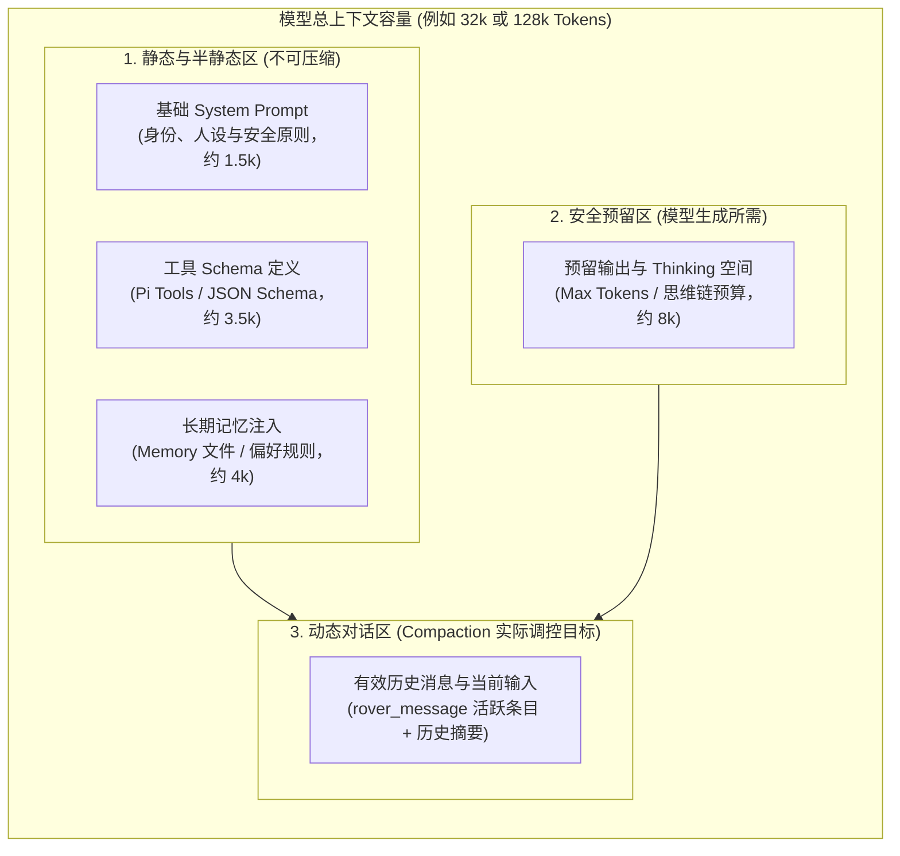

# 记忆分层、带锚点压缩与动态上下文预算

> 状态：已采纳 · 2026-09-29

Rover 将 Agent 记忆严格划分为两层治理：**“SQLite 中的工作记忆（`rover_message`）”** 与 **“文件系统中的长期记忆（Markdown 文件）”**。工作记忆服务于当前连续交互流，采用多对一的**逻辑归档标记（`is_compacted = 1`）与锚点保留摘要**，杜绝简单物理 LRU/FIFO 删除；长期记忆存储于本地用户可审阅的 Markdown 文件中，并在 Compaction 阶段作为沉淀知识的提炼触点。同时，Compaction 触发阈值采用**动态配额扣减模型**，将系统人设、工具 Schema、长期记忆注入与思考模型（Thinking）的生成预算统一统筹；放弃类似 `divisor-agent` 的 DAG 树状 `Entry` 抽象，坚持单线全局对话与职责正交。

做出该决定的核心原因在于：

1. **工作记忆与长期记忆认知维度的本质正交**：
   * 很多 Agent 系统混淆了“上下文窗口防爆仓”与“用户长期画像/偏好留存”。
   * **工作记忆（SQLite `rover_message`）**：关注近期对话的时序连贯与因果，必须随多轮交互滚动，并由 Compaction 抑制长度；
   * **长期记忆（文件系统）**：关注用户偏好（如“习惯使用 pnpm”）、项目技术栈与全局约束，要求人类完全透明、可在 Finder/VSCode 中自由查阅和纠偏，且易于版本控制。
   * **两者相辅相成**：Compaction 是长期记忆的最佳“蒸馏提炼点”——在折叠归档老旧对话时，顺便提炼高价值用户规则沉淀入文件系统，实现短期向长期的自然跃迁。

2. **杜绝物理删除（LRU），捍卫事实锚点（Anchors）不变式**：
   * 简单的 FIFO 或 LRU 物理删除老消息会造成严重的“上下文锚点断裂”（如第 1 轮确立的工作区路径、分支名或派发的 Task ID 在多轮后被删，导致模型后期失去方向）。
   * 采用 `is_compacted = 1` 逻辑归档，配合生成的带锚点系统摘要（Summary），既将有效上下文压缩 90%，又保证核心实体不丢失，同时完整保留用户数字资产的可追溯性。

3. **动态上下文预算避免思考模型与工具调用引发溢出崩溃**：
   * 现代 Agent 运行时，不可压缩的**工具 Schema（Pi Tools）**可占 2k~4k Tokens，注入的**长期记忆**占 2k~6k Tokens，而**思考模型（Claude 3.7 Thinking / DeepSeek R1 / Gemini Thinking）**需要预留 4k~16k Tokens 的 Thinking/生成空间。
   * 若孤立按 `rover_message` 字数占比（如静态 70%）触发 Compaction，总 Token 极易突破模型硬限制引发 `context_length_exceeded` 致命中断。必须动态计算留给对话历史的实际可用净预算。

4. **保持单线全局历史，拒绝 `divisor-agent` 树状 `Entry` 的过度设计**：
   * `divisor-agent` 作为 IDE 工作台，其 `Entry` 抽象核心是为了支持 `parentId` 追溯的会话分支（Forking）和模型切换多态日志；
   * 依据 [ADR-0001](./0001-global-rover-history.md) 与 [ADR-0002](./0002-code-agent-session-owns-task-conversation.md)，Rover 是跨目标的常驻桌面伴侣，只有一条单向向前流动的全局上下文，不支持也不需要分支树；长篇编码对话完全由终端 CLI 原生 Session 持有。Rover 内部职责高度解耦（`rover_message` 记对话、`task_event` 记 CLI 事实并级联删除、`activity` 记成果台账、`runtime_event` 记增量重放），无需大一统的 `Entry` 概念。

---

### 一、模型上下文窗口动态预算模型

发起 LLM 调用时，整个 Context 由静态区、预留区和动态区三者组成：



#### 动态历史配额计算公式
在发起回合准备构建 Prompt 时，Runtime 动态计算传给 `getEffectiveHistory(limitTokens)` 的参数：

$$\text{History\_Budget} = \text{Model\_Max\_Context} \times \text{安全系数 (0.85)} - \text{Fixed\_Tokens} - \text{Reserved\_Output\_Tokens}$$

* 一旦用户注入了更庞大的长期记忆文件或复杂的工具 Schema，`History_Budget` 会自适应缩小，Compaction 引擎会更加积极、前置地压缩老旧消息。

---

### 二、`rover_message` 表结构演进与 Thinking 支持

为兼顾 Pi Agent Core 原生多块（Content Blocks）以及现代推理模型的思维链支持，Ticket 001 的 `rover_message` 表按以下结构落地：

```sql
CREATE TABLE rover_message (
  id TEXT PRIMARY KEY,
  turn_id TEXT NOT NULL,
  role TEXT NOT NULL,                  -- 'user' | 'assistant' | 'system'
  content TEXT NOT NULL,               -- 面向人类阅读的纯文本（检索、UI 气泡专用）
  thinking TEXT,                       -- 模型的思维链过程（供查看排查，下轮默认不原样回喂）
  metadata TEXT,                       -- JSON: { usage, stopReason, thinkingSignature, model }
  token_estimate INTEGER NOT NULL,
  is_compacted INTEGER DEFAULT 0,      -- 0: 活跃上下文; 1: 已归档
  compacted_into_id TEXT,              -- 溯源指针：记录被合并到了哪条系统摘要消息
  created_at TEXT NOT NULL
);

CREATE INDEX idx_rover_message_effective ON rover_message(is_compacted, created_at);
CREATE INDEX idx_rover_message_turn ON rover_message(turn_id);
```

#### 思考模型（Thinking）处理准则
1. **展示与存储**：流式阶段通过 WebSocket 下发 `thinking_delta`，宠物端显示思考动效或折叠栏；落库时将思考文本存入 `thinking` 字段，最终回复存入 `content`。
2. **多轮延续与压缩**：在组装下一轮 Context 及执行 Compaction 时，**默认剥离上一轮的 `thinking` 过程**，严禁将冗长的思考链作为历史记忆无脑转发给后续调用，防止跨供应商模型污染与 Token 严重浪费。

---

### 三、备选方案权衡（Considered Options）

* **采用单一物理滚动环形缓冲区（FIFO / LRU 物理删除最老消息）**：
  * *否决原因*：严重破坏用户长期设定的事实锚点（如仓库路径、规则、Task ID）；且本地 SQLite 文本开销微乎其微，物理删除会损毁用户的对话历史资产。
* **照搬 `divisor-agent` 的 DAG 树状 `Entry` 抽象（含 `parentId`）**：
  * *否决原因*：Rover 的核心定位是无分支、跨目标的桌面常驻伴侣（见 [ADR-0001](./0001-global-rover-history.md)），不需要复杂的 Fork 机制；且 Rover 已具备高度正交的 `task_event`、`activity` 与 `runtime_event`，引入树状 Entry 纯属增加概念负担的过度设计。
* **仅依赖数据库存储全部长期记忆与短期历史**：
  * *否决原因*：长期知识沉淀缺乏透明度与人类干预能力；文件系统 Markdown 让用户随时可以审阅与手工纠偏，且便于跨终端和被 Code Agent 直接引用。
