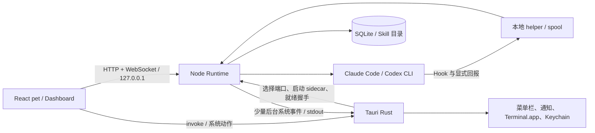
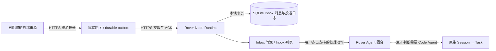

# Rover MVP 技术需求文档（TRD）

> 状态：实施基线已确认 · 2026-09-27  
> 产品约束：[Rover 产品设计文档](../product/Rover%20产品设计文档.md) · [领域术语](../../CONTEXT.md)  
> 目标：macOS 14+ 本地可安装的 Rover；同时支持 Apple Silicon 与 Intel。本文定义工程边界、协议、数据、失败恢复和验收。产品交互以产品设计文档为准。


## 1. 技术结论与不变量

| 决策 | MVP 方案 |
| --- | --- |
| 桌面端 | React 19 + Vite + Tailwind CSS 4；输入栏使用 Tiptap 3；Tauri 2 的 Rust 宿主管理窗口、菜单栏、通知、Keychain、Terminal.app 与 sidecar |
| Agent 运行时 | `packages/runtime` 中的 Node 22；优先 Pi Agent Core + Pi AI，固定经过验证的版本；Rover 自行持有领域状态和工具授权 |
| 工程 | pnpm workspace + Turborepo + TypeScript strict + oxlint + oxfmt，参考 Traceability 的约定，最终仓库只有 `packages/app` 和 `packages/runtime` 两个 workspace 包 |
| app ↔ runtime | React 直连 Node 的 `127.0.0.1` HTTP API + 同端口 WebSocket 事件流；Rust 选择端口、启动/监督 sidecar，并向 WebView 提供临时连接信息 |
| CLI 会话 | 仅收录 Rover 派发的 Claude Code/Codex 原生 Session；后台启动，点击 Task 才用 Terminal.app 接入原会话 |
| 状态观察 | Agent 原生 Hook + Code Agent 显式结果回报 + 本地进程事实；不把 Clawd 或 Herdr 当运行依赖 |
| 数据 | Node 单写者的 SQLite；敏感凭据在 Rover 自己的 macOS Keychain；共享 `~/.pi/agent/models.json` 模型目录，不读取 Pi `auth.json` |
| Inbox / 外部投递 | 外部来源 → 受鉴权的远端事件网关 → Rover 主动 HTTPS 拉取/确认 → 统一 Inbox；未读消息使 Inbox 气泡常显。告警是 `alert` 类型，不另建告警列表。只有实际建立 Code Agent Session 才生成 Task。详见第 8 节。 |

**领域不变量。** 一个 Task 恰好对应一个由 Rover 派发成功的 Code Agent 原生 Session；一次即时回答、定时触发失败、Inbox 消息到达本身均不自动构成 Task。原 Session 的后续用户交互留在 CLI。Rover 的 history、Task 注册表、Inbox 各自独立；模型输出不能冒充会话状态或外部事件的事实来源。

## 2. 仓库与构建边界

```text
Rover/
  package.json                  # private；pnpm、turbo、lint/typecheck/test/build 脚本
  pnpm-workspace.yaml           # packages/*；限制原生依赖安装脚本
  pnpm-lock.yaml
  turbo.json
  tsconfig.base.json
  oxlint.config.ts
  oxfmt.config.ts
  docs/
  scripts/                      # 目标架构打包、资源校验、签名/DMG 脚本
  packages/
    app/
      package.json
      src/                      # React：pet、task、dashboard、settings
      src-tauri/
        Cargo.toml
        tauri.conf.json
        capabilities/
        src/                    # 窗口、托盘、通知、Keychain、Terminal、sidecar、IPC
        src/bin/                # 本地 Hook/Code Agent 回报 helper
        binaries/               # 目标三元组命名的 Node sidecar
        resources/              # runtime JS、生产依赖、迁移、内置 Skill、素材
    runtime/
      package.json
      src/
        transport/              # loopback HTTP/WS、鉴权、协议与事件流
        agent/                  # Pi adapter、history、模型能力、工具策略
        skills/                 # 内置与受管用户 Skill
        dispatch/               # Claude/Codex adapters、会话承载与恢复
        observe/                # Hook、回报、状态归并
        scheduler/              # 计划、运行记录、错过触发
        ingress/                # Inbox 投递规范化、去重、提醒与用户处理入口
        storage/                # SQLite schema、迁移、查询
        reporting/              # 最近活动、Task 摘要检索
```

根脚本至少提供 `dev`、`build`、`typecheck`、`lint:check`、`format:check`、`test`、`package:mac:arm64`、`package:mac:x64`。锁文件固定依赖；CI 用 `pnpm install --frozen-lockfile`，执行格式/静态检查、类型、单元与契约测试、两架构打包。参考 Traceability 的工具链与配置写法，不复制它的 Electron/server 目录或私有配置。Runtime 产物不能依赖用户预装 Node。

Runtime 保留上述按能力划分的目录：Agent loop、CLI 派发、状态观察、调度和外部接入各有直接对应的位置，MVP 无需再套一层 `modules/<domain>`。这项决定只规定文件归属；单文件内部是否拆出函数、类或子组件按实际职责与复用情况判断。

**打包实施路径。** 每个 CPU 架构各构建一份 Node 可执行文件，按 Tauri `externalBin` 的 target triple 命名；将 runtime 编译后的 ESM、生产依赖、原生模块、迁移和内置 Skill 放进 app resources。Rust 启动该随包 Node 并显式指向入口文件。先验证 Pi 模块和 SQLite 原生模块在 `.app` 内可加载、签名后仍可加载，再固定构建脚本；避免把需读取资源的运行时仓促压进 Node SEA。发布本地可安装包，手动下载新版覆盖安装，升级时保留 App Support 数据并运行向前迁移；开发包可本机安装，向外部分发签名包须补齐签名与 notarization。

### 2.1 代码组织规则

借鉴 Traceability 的文件内组织方式；目录保持上面的 Rover 结构，不引入 `modules/<domain>` 或 Electron 式进程目录。每个文件围绕一个可命名的职责。不要因为某段逻辑“可能复用”就提前搬到 `shared`/`utils`；出现实际跨文件使用、独立契约或独立生命周期时再提取。类型和函数可与使用处同文件，避免一处使用的定义被拆散；共享类型只暴露必要的公开形状，不让 UI 依赖 SQLite 行或 Pi SDK 类型。

**React。** 使用函数组件和 Hooks，不写 class component。组件文件在 imports、类型和必要常量之后先定义该文件主要的 `export function Component`；它专用的子组件按调用关系依次写在下方，保持不导出。只服务该组件的事件处理、状态推导和自定义 Hook 留在同一文件：需要闭包状态的函数写在组件内部，专用子组件与私有 Hook 可放在主要组件下方。**工具方法如果只在这一个文件使用，而且只有一个调用点，就在调用处直接实现，不额外抽出一个工具函数。**确实出现多个调用点时才考虑文件内私有函数；被别的页面实际使用的子组件或 Hook 才独立成文件，跨区域复用时才放入共享目录。不使用默认导出和泛化的 `helpers.ts` 汇集无关函数。组件只负责展示和用户交互；HTTP/WS 访问集中在受类型约束的 Runtime client 与数据 Hook，不在 JSX 中拼 URL 或直接操作 SQLite/CLI。服务器状态用 TanStack Query 管理快照与失效，WebSocket 事件更新/失效对应查询；输入框与宠物动画等临时状态留在组件附近，避免全局 store 承载全部 UI 状态。

```tsx
export function TaskList({ tasks }: TaskListProps) {
  const visibleTasks = tasks.filter((task) => task.visible);
  return visibleTasks.map((task) => <TaskCard key={task.id} task={task} />);
}

function TaskCard({ task }: { task: TaskView }) {
  return <button type="button">{task.goal}</button>;
}
```

**Node Runtime。** 沿用 `transport/agent/skills/dispatch/observe/scheduler/ingress/storage/reporting` 目录。文件内借鉴 Traceability 的清晰职责：对外入口或主要用例在前，专用私有函数在后；HTTP handler 只解析/校验输入并映射响应，Agent/派发/计划等业务规则留在对应目录，SQL 查询留在 `storage/`。Claude/Codex、Pi 与监控平台接入由窄接口隔开，依赖在启动时显式装配；没有实际分工时不强行把简单操作拆成 route/service/repository 多文件。纯转换与校验优先用函数；持有连接、缓存或生命周期状态时可用工厂或类。避免一个文件同时处理 HTTP、模型 loop、SQL 和系统调用，也避免 `utils.ts` 汇集无关逻辑。跨目录只依赖明确公开的接口，禁止循环依赖；领域状态使用 Rover 自己的类型，不直接持久化 Pi/Claude/Codex SDK 对象。

**共同约束。** TypeScript strict、显式返回/错误类型、`import type` 与现有 oxlint/oxfmt 规则；用户可见错误有稳定错误码，日志有请求/回合/Task ID 但不含凭据。测试贴近业务规则和进程边界：端口握手、派发幂等、状态归并、计划错过及告警去重必须验证；仅镜像组件实现的低价值测试不作为指标。Code review 检查单调用点的工具方法是否被多余抽取、组件私有逻辑是否被过早移走、模块是否跨层取数、文件是否同时承担多个无关变化原因，而不设置机械行数上限。

### 2.2 输入栏编辑器与命令引用

React 的**输入栏**使用 Tiptap 3，不使用普通 `<textarea>` 承载正式 Prompt。依赖包括 `@tiptap/react`、`@tiptap/pm`、`@tiptap/starter-kit`、`@tiptap/extension-placeholder`、`@tiptap/extension-mention` 和 `@tiptap/suggestion`；同一 Tiptap 系列固定兼容版本并写入锁文件。编辑器保留段落、文本和换行等输入所需节点，关闭标题、列表等无关富文本能力。参考 Traceability 的 `PromptInput`、`useChatEditor`、`slash-commands`、`hash-commands`：由 `useEditor`/`EditorContent` 承载编辑器，由各触发符的 Suggestion 扩展管理候选菜单，用独立的节点类型与 PluginKey 避免建议状态互相干扰；Rover 的候选来源和语义按下表重新定义，不复制 Traceability 的 Skill/Issue 约定。[Tiptap React](https://tiptap.dev/docs/editor/getting-started/install/react) · [Mention](https://tiptap.dev/docs/editor/extensions/nodes/mention) · [Suggestion](https://tiptap.dev/docs/editor/api/utilities/suggestion)

| 触发符 | MVP 行为 | 选中后的结构化引用 |
| --- | --- | --- |
| `@` | 提示可派发的 Claude Code、Codex；用户选中一个 Agent 后仍可继续写目标 | `kind: "agent"` + 稳定 Agent ID |
| `/` | 提示当前已启用、可由 Rover 调用的 Skill；选中后仍由 Skill 流程决定是否派发 | `kind: "skill"` + 稳定 Skill ID |
| `#` | 搜索并引用本地 Inbox 消息，候选包含未读消息与可查看的已读历史；选中后可继续输入问题或处理要求 | `kind: "inbox"` + 本地 Inbox 消息 ID |

Tiptap 编辑器状态只在 React 输入栏内管理。提交与待处理 Prompt 队列统一使用 Rover 自己的 `PromptDocumentV1`，顺序保存文本片段与已选引用，例如 `{ "v": 1, "parts": [{ "type": "reference", "kind": "inbox", "id": "<本地消息 ID>" }, { "type": "text", "text": " 帮我分析这条告警" }] }`；换行保存在文本片段中。React 从 Tiptap JSON 节点生成该结构并显示可读预览，`POST /v1/turns` 只传这份受限结构，不传 HTML 或原始 Tiptap JSON。Node 校验版本、节点类型、长度、Agent/Skill ID 与当前启用状态、Inbox 消息 ID 的存在性及组合规则，再生成提供给 Rover Agent 的文本及确定性路由信息；选中引用以稳定 ID 为准，不从显示标签或 `getText()` 反猜。用户手输或粘贴的 `/skill`、`@Agent` 仍按已定义的显式语法作精确匹配；未选择建议项的普通 `#` 文本不自动匹配 Inbox 消息。已排队 Prompt 保存同一 `PromptDocumentV1`，用户确认前不发往 Runtime 或 Agent history。

`#` 候选通过受鉴权的 `GET /v1/inbox?query=<文本>&limit=<数量>` 取得，包含未读和已读消息，服务端限制返回数量；结果只含消息 ID、类型、来源、标题和阅读状态等展示字段，不把外部消息正文嵌入编辑器节点。选择或提交 Inbox 引用本身不标已读、不改变处理状态，也不自动派发 Code Agent；提交 Prompt 是用户主动开启 Rover 回合，Runtime 按消息 ID 通过受控查询取得提交时最新的本地修订作为必要证据，消息正文仍按不可信外部数据处理。若消息在选择后被删除或已不可访问，提交返回可修复错误并保留草稿，不把失效 ID 当成普通文字悄悄发送。

编辑器有候选菜单时，`Enter` 选择候选，不提交 Prompt；菜单关闭且未处于中文输入法组合阶段时，`Enter` 提交，`Shift+Enter` 换行，`Escape` 关闭候选。候选支持键盘方向键与鼠标选择；没有匹配项或来源加载失败时保持纯文本可输入。建议菜单的展示与过滤属于 React，候选列表经受类型约束的 Runtime client 读取，Node 仍决定哪些引用有效。`PromptInput` 的提交、队列与只服务它的 Hook 留在组件附近；每种独立 Suggestion 扩展可按职责成文件，不建立大而全的编辑器工具模块。

## 3. 进程、窗口与本机通信

### 3.1 三层职责与能力边界

| 层 | 持有的职责与能力 | 明确不持有 | 可交互边界 |
| --- | --- | --- | --- |
| React WebView | 宠物、气泡、输入队列、Task 卡片、Dashboard、动画与局部 UI 状态；调用本机业务 API、订阅事件流、发起受限系统动作 | SQLite 写入、Agent loop、CLI 子进程、模型凭据持久化、任意文件/系统操作 | 业务数据只经 Node 的 HTTP/WS；窗口/终端/对话框/凭据设置只经 Tauri 命令 |
| Tauri Rust 宿主 | 宠物与 Dashboard 窗口、菜单栏、系统通知、Keychain、Terminal.app、文件对话框；选择端口、启动/监督 Node sidecar、限制并转发少量系统控制消息 | Rover 对话与 Skill 判断、Task 成败推断、计划/Inbox 业务状态、业务数据库写入 | 接收 React 的受限 `invoke`；与 Node 用启动/控制管道和必要的内部 HTTP 查询协作 |
| Node Runtime | 本机 HTTP/WS API、Pi Agent loop、Skill 加载与工具策略、模型配置、全局 history、Task/Session 注册及状态归并、定时计划、Inbox 消息、Claude/Codex CLI 派发、SQLite 唯一写入 | React 画面/窗口焦点、原生通知绘制、Keychain 实现、桌面文件对话框；不接管 Code Agent 原 Session 的批准与续办 | 只监听 `127.0.0.1`；面向外部监控服务主动发 HTTPS；系统动作向 Rust 请求，不把窗口操作混入业务模块 |

Node 为派发 Code Agent 可以受控读取目标仓库和启动指定 CLI；“桌面系统能力归 Rust”指窗口、菜单栏、通知、Keychain、终端接入与选择器，**不阻止** Node 执行经过工具策略约束的本地 Agent 工作。Hook helper 是 CLI 上报的轻量适配入口，不是独立业务层；它不能直接改 Task 状态，只提交可核查事件供 Node 归并。Task、计划和 Inbox 的事实来源是 Node 持有的本地记录，React 与 Rust 只取得所需投影。

典型调用链固定为：用户提交目标时 `React → HTTP → Node`，Node 落库后经 WS 更新界面；派发时 `Node → CLI → Hook helper → Node`，有原生 Session ID 才形成 Task；点击 Task 时 `React → Tauri invoke → Rust → Node 内部查询 → Terminal.app`；后台消息为 `远端服务 → Node → SQLite/Inbox 去重与提醒 → WS 界面与 Rust 系统通知`。关闭全部窗口后，最后一条链仍可工作。

### 3.2 进程拓扑与传输



Tauri 创建一个透明宠物窗口和一个独立 Dashboard 窗口；macOS 菜单栏 Rover 图标的右键菜单提供「打开 Dashboard」「显示宠物」「退出 Rover」，只有该菜单提供 Dashboard 入口，宠物区域不直接打开它。关闭宠物窗口只隐藏窗口，菜单栏进程与 Node 继续。明确退出 Rover 时停止 sidecar 与本地计划轮询，但不杀死已派发 CLI；下次启动核对这些 Session。Runtime 意外退出后 Rust 按有上限的指数退避重启，UI 显示连接中；重连先取快照，再订阅增量事件。Runtime 只能有一个本地实例写数据库；用应用级锁防止双开。通信协议不依赖 macOS，未来 Windows 只需实现对应 Tauri 系统能力与 sidecar 打包；本版产品验收仍限 macOS。

**启动与端口发现。** Rust 在 `127.0.0.1` 上取得一个空闲端口，生成每次启动独立的高熵 API 令牌，将端口作为 sidecar 启动参数、令牌通过私有 stdin 启动消息传入。Node 必须只绑定 `127.0.0.1:<port>`，完成迁移和监听后在 stdout 发送带协议版本、端口与实例 nonce 的 `ready`；Rust 再用令牌请求 `/v1/health`，核对 nonce，才通过受限 Tauri `invoke` 把 `baseUrl` 与临时令牌交给 React。端口探测与 Node 绑定之间可能有竞争，遇到 `EADDRINUSE` 时 Rust 换端口并重启，不假定探测等于预留。Node 异常退出后令牌和端口同时作废；前端重新获取连接信息。标准输出只写启动/系统控制消息，诊断写 stderr，不用它转发常规业务请求。

**窄控制通道。** Rust 与其子进程间的 stdin/stdout 保留带 `requestId` 的小型 JSON 控制消息：启动就绪、后台通知请求，以及 Node 读取 Rover Keychain 凭据。用户在 Dashboard 设置凭据时经受限 Tauri 命令直接写入 Keychain；Node 在需要调用模型时向 Rust 请求对应密钥，Rust 只沿私有子进程管道返回，WebView 的配置查询只能得到“已设置/未设置”。所有窗口隐藏时，Rust 仍能处理 Node 的通知请求。控制通道不是业务 API，消息类型固定、超时且限制大小，秘密值不写入日志。

**HTTP 与事件流。** HTTP 负责有明确结果的命令和快照，WebSocket 负责 Rover 回合的流式增量与 Task/计划/Inbox 事件；两者使用同一个 loopback 端口和 `/v1` 协议版本。所有 HTTP 业务请求带 `Authorization: Bearer <临时令牌>`，写操作还带 `Idempotency-Key`；WebSocket 在升级时核对允许的 WebView `Origin`，连接建立后的第一帧发送令牌和上次 `eventSeq`，未及时鉴权即关闭。Node 对浏览器请求只允许已验证的 Tauri WebView 来源，开发环境来源单列；CORS、预检与 WebSocket Origin 校验不能代替令牌鉴权。Tauri CSP 的 `connect-src` 仅允许 `http://127.0.0.1:*` 与 `ws://127.0.0.1:*` 等必需来源，动态端口不扩大到任意主机；macOS 和未来 Windows 的 WebView Origin 分别实测后加入允许列表。临时令牌只存在进程内存，不进入 URL、日志、localStorage 或持久配置。原始 API Key、完整模型上下文及 Hook 原文不返回给 WebView。[Tauri CSP](https://v2.tauri.app/security/csp/)

**重连语义。** WebSocket 事件包含 `v: 1`、`eventSeq`、`type`、`payload`，由数据库提交后递增；请求有超时及结构化错误，单条消息限制 1 MiB。每项持久领域变更与对应 `runtime_event` 在同一 SQLite 事务写入；`GET /v1/state` 在一致性读事务内返回权威快照及其 `eventSeq`。React 再连接 `/v1/events` 并在鉴权首帧带上该序号。Node 先为连接登记实时缓冲队列，再读取并按序重放 `eventSeq` 之后的已提交事件，最后冲刷缓冲队列中尚未发送的更大序号事件；这样快照与订阅之间、重放与实时切换之间都不漏更新。若游标早于保留范围或连接缓冲溢出，Node 发 `resync_required`，React 重新取快照；重复序号由客户端去重。流式 token 可丢弃并从当前回合状态恢复，Task/计划/Inbox 变化不能只保存在内存事件流里。多个窗口共享同一 Runtime 实例，各自可订阅；Rust 只接收必要的后台系统事件，确保所有 WebView 隐藏时仍能发系统通知。

| 能力 | HTTP API / WebSocket 事件 | 系统动作 |
| --- | --- | --- |
| 生命周期 | `GET /v1/health`, `GET /v1/state`, `WS /v1/events` | Rust 监督 sidecar、分发临时连接信息 |
| 输入 | `POST /v1/turns`, `POST /v1/turns/{id}/cancel`；`turn.delta` / `turn.end` | 无 |
| Task | `GET /v1/tasks`, `GET /v1/tasks/{id}`；`task.changed` | React 调用 Rust `open_task(id)`；Rust向 Node 核实 Session 定位后打开 Terminal.app |
| 计划 | `GET/POST /v1/plans`, `POST /v1/plans/{id}/pause|resume`, `DELETE /v1/plans/{id}`；`plan.changed` | 后台通知由 Rust 处理 |
| Skill | `GET /v1/skills`, `POST /v1/skills/install`, `POST /v1/skills/{id}/enabled` | 目录选择器由 Rust 打开，Runtime 受控复制 |
| 模型与数据 | `GET /v1/models`, `PUT /v1/models/selection`, `POST /v1/data/export|delete` | Keychain 读写及本地文件对话框经 Rust 受限命令 |
| Inbox | `GET /v1/inbox`, `GET /v1/inbox/{id}`, `POST /v1/inbox/{id}/read`, `POST /v1/inbox/{id}/handle`, `POST /v1/inbox/{id}/retry`；`inbox.changed` | `id` 是本地 Inbox 消息 ID；气泡与后台系统通知由 Rust/React 展示 |

React 直接调用 Node 的**本机受鉴权业务 API**，但不直接启动 CLI、调用 Keychain 或接入外部监控平台。Rust 的命令只处理桌面系统能力；对 `open_task(id)` 等特权动作，Rust 根据 Task ID 向 Node 查询可信的原生 Session 信息，不执行 WebView 传来的任意 shell 文本或路径。Node 向 Rust 的后台通知可走父子进程 stdout 上的小型控制消息，绝不依赖当前是否有可见 WebView。远端告警仍走第 8 节的独立 HTTPS 接入链路，不把本机 API 暴露给监控服务。

## 4. Rover Agent、Skill 和模型

**回合调度。** 先从经校验的 `PromptDocumentV1` 引用和显式文本语法中确定性解析 `/skill`、`@Agent`、`#` Inbox 消息引用及“继续已有 Task”的明确意图，再把需要判断的输入交给 Pi Agent Core loop。每次 Rover 回合有步数、耗时、并发和 token 预算；一份全局 history 跨输入持久化，接近模型上下文限制才压缩。待处理 Prompt 队列留在 UI 内存，用户确认后才进入 history。Inbox 消息到达不自动启动模型回合，也不把原始消息写入全局 history。用户点击「交给 Rover 处理」或主动提交包含 `#` 引用的 Prompt 后，才启动 Rover 回合，通过受控工具按 Inbox 消息 ID 读取证据；消息正文始终是数据，不当作用户指令。

**模型能力。** 使用 Pi AI 的提供商/模型抽象，固定测试过的包版本。模型目录与 Pi/Traceability 共用 `~/.pi/agent/models.json`；读取时保留未知字段，写入前比较文件版本并原子替换，外部变更时重新加载或让用户处理冲突。本次运行中若文件后来变得无效，继续使用内存中最后一次有效配置并提示修复；若启动时文件已无效且没有有效配置，则禁用模型调用直到修复，不另存一份可能含密钥的明文快照。Rover 保存的密钥在自己的 Keychain 项中；允许读取 `models.json` 已有的 `apiKey`，不读取 Pi 的 `auth.json` 登录令牌。Dashboard 做模型连通性与工具调用能力检查；Code Agent CLI 的认证仍由各自 CLI 管理。模型切换不承诺各供应商行为等价，记录工具调用能力、上下文限制与配置错误。

**工具边界。** Rover Agent 只得到受控的 Skill 读取、Task/摘要查询、目标仓库只读查询、计划管理、Inbox 查询与派发能力。Runtime 为每个工具实施输入校验、权限范围、超时和审计；业务 Skill 只是流程文本，不扩展权限。Rover Agent 不得到任意 shell、通用文件写入或任意网络请求工具。代码修改交由 Code Agent 原 Session；它的批准仍在 CLI。内置 Skill 至少有 `agent-dispatch`、`task-recall`、`pet-task-state`、`scheduled-task` 和告警消息处理流程。业务 Skill 可从 App 资源与 Rover 专属用户目录加载；安装时将用户选中的文件夹复制进受管目录，检验 `SKILL.md`、路径穿越和软链接，保存来源和启用状态；禁用不删除历史引用。

## 5. Code Agent Session 承载与状态

**MVP 承载候选定为系统自带 GNU Screen。** Rover 为每个派发尝试生成不可重用的内部 ID，在后台以参数数组启动 `/usr/bin/screen -dmS rover_<id> <cli> ...`，给子进程注入 `ROVER_DISPATCH_ATTEMPT_ID` 与必要的最小回报能力；绝不经 shell 拼接用户 Prompt。这样两种 CLI 都有可保留的 TTY，会话运行中等待批准时不需要前台 Terminal.app。此方案是首个集成门槛：须在目标 macOS 14+、两种 CPU 与两种 CLI 上验证 Screen 的 TUI、权限交互、Hook、中文输入、重连及安装包环境；不通过时停在验证阶段重选承载，不降低“同一 Session”承诺。Claude 的原生后台 Agent view 仍是研究预览，不作为 MVP 必需能力。[GNU Screen](https://www.gnu.org/software/screen/manual/screen.html) · [Claude 后台 Agent view](https://code.claude.com/docs/en/agent-view)

派发先生成尝试 ID、预留 Task UUID 与仅绑定该尝试的回报令牌，并写入 `dispatch_attempt`；此时没有 Task 记录或可见卡片。然后启动 CLI，传入尝试 ID、预留 UUID 和令牌。Claude 使用受支持的 `--session-id` 预分配原生 UUID；Codex 用 `SessionStart` Hook 取得原生 Session ID。只在原生 ID 已由可信信号确认并唯一关联后，以单个事务建立 `session_ref` + `task` + 首个事件，并把已收到的尝试级回报关联至该 Task；若始终没有 Session，回报只留作派发诊断，不显示空 Task。若在启动与登记之间崩溃，恢复时按尝试 ID 查 Hook spool 和承载进程，能核实才补登记；不明时留内部待核对尝试，不盲目重派。手动和定时派发都不抢前台。

点击 Task 时，Rust 用 Terminal.app 创建或聚焦执行 `screen -r <受校验的内部名>` 的标签；如果 Screen 会话已经退出，在 Terminal.app 中按持久原生 ID 运行 `claude --resume <UUID>` 或 `codex resume <ID>`。保存窗口 ID / TTY 只用于寻找当前标签，不当作持久 Session 身份。Terminal.app 自动化权限失败时展示明确修复入口；MVP 不承诺其他终端。Rover 退出时不执行 Screen quit，不终止 Code Agent；系统关机后承载进程消失，原生 CLI 记录可用于按 ID 恢复。[Claude CLI](https://code.claude.com/docs/en/cli-reference) · [Codex CLI](https://learn.chatgpt.com/docs/developer-commands?surface=cli)

**Hook 与回报。** 安装引导明确征得用户同意后，在用户级 Claude/Codex 配置中合并只读 Hook；保存 Rover 自己插入的标识和备份，支持检测、修复、卸载，绝不覆盖其他 Hook。Hook helper 是随 app 打包的独立可执行文件，首次启动复制到 Application Support 的稳定路径，升级时原子替换；Hook 配置只引用该稳定路径，避免 `.app` 移动后失效。Helper 从 stdin 读事件并将经校验的最小事件原子写入 Rover 的本地 spool。它以尝试 ID 或已登记的原生 Session ID 过滤，只追踪 Rover 派发会话；Rover 完全退出时事件仍可在下次启动时重放。Code Agent 可通过同一个 helper 的受限 `report` 命令回报进展、结果和可选可引用摘要；以派发尝试的能力令牌校验，注册 Task 后令牌继续绑定该 Task，文件权限仅当前用户可读。Hook 执行需限时且不阻断 CLI；重复事件按源 ID 幂等写入。[Claude Hooks](https://code.claude.com/docs/en/hooks) · [Codex Hooks](https://learn.chatgpt.com/docs/hooks)

**状态投影。** `SessionStart` 证明会话建立，`PermissionRequest` / 可靠等待信号证明需用户介入，`Stop` 只证明一轮停止，`Interrupt`、`StopFailure`、`SessionEnd` 与承载退出各有不同语义。Code Agent 显式回报结果才可显示“已完成”或“未完成”；没有结果语义而进程结束则显示“状态待核对”。单次工具错误生成事件，不直接判失败。原 Session 后续恢复沿用同一个 Task，保留先前终态事件。Hook 或回报冲突时保留证据并标待核对；绝不解析 CLI 终端文字作为完成证据。

## 6. 本地数据与恢复

Node 是唯一 SQLite 写者；MVP 使用固定版本的 `better-sqlite3`，应用数据放在 macOS Application Support/Rover，启用 WAL、外键与迁移版本。数据库保存领域状态，原始大日志按大小轮转；默认不保存完整 CLI 对话、完整 Inbox 敏感载荷或模型 API Key。下表中的 `id` 为 UUID，时间用 UTC，界面转为本地时区。

| 表/文件 | 关键字段、约束与用途 |
| --- | --- |
| `rover_turn` | Rover 输入回合生命周期投影与原始 `PromptDocumentV1`；`id`, `status`, `prompt_doc`, `error?`, `created_at`, `completed_at?`，以 [ADR-0014](../adr/0014-linear-rover-entries-and-compaction.md) 为准 |
| `rover_entry` | `seq`, UUID `id`, `turn_id?`, `type`, `schema_version`, JSON `data`, `created_at`；每个 message entry 保存完整原始 AgentMessage，成功压缩追加独立 compaction entry；有效上下文按覆盖边界重建，见 [ADR-0014](../adr/0014-linear-rover-entries-and-compaction.md) |
| `dispatch_attempt` | `id`, `candidate_task_id`, `source_kind`, `source_id`, `agent`, `cwd`, `status`, `native_session_id?`, `report_token_hash`, `error?`；`source_kind+source_id+agent+dispatch_index` 唯一 |
| `session_ref` | `task_id` 唯一，`agent+native_session_id+config_dir` 唯一，承载名、last_seen、availability |
| `task` | `id`, `goal`, `agent`, `status`, `progress_text`, `result_text`, `created_at`, `updated_at`；与 Session 1:1 投影，不含外部来源或 skill 分类标签；创建需同时有 `session_ref` |
| `task_event` | `id`, `task_id`, `source`, `source_event_id`, `kind`, `observed_at`, `summary`, `evidence_ref`；来源事件去重 |
| `task_summary` | `task_id` 唯一，Code Agent 写出的内容、更新时间、来源；允许缺失，独立于 Task 卡片文案 |
| `plan` / `plan_run` | 规则、IANA 时区、下一次触发时间、启停；每次触发的成功/失败/错过记录及可选 Task ID |
| `activity` | 已结束 Task 或 Rover 实际完成的操作及发生时间，不从普通问答自动生成 |
| `runtime_event` | 自增 `event_seq`、事件类型、最小投影、提交时间；与领域变更同事务写入，供 HTTP 快照之后的 WebSocket 重放；按保留窗口清理并在缺口时要求重新取快照 |
| `skill_install` | 受管路径、内容摘要、版本、来源、启用状态 |
| `inbox_source` / `inbox_delivery` / `inbox_message` | 外部来源授权、投递事件去重、同来源消息修订与当前投影、阅读状态、气泡提醒状态；告警保存在 `inbox_message.payload`，详见第 8 节 |
| `inbox_action` / `inbox_task` / `delivery_cursor` | 用户点击及 Rover 回合结果、关联 Task、本地已连续提交的远端投递序号；消息到达本身不产生回合或 Task |

可引用 Task 摘要只由原 Session 的 Code Agent 明确提交，采用数据库正文 + 修订时间；`task-recall` 只索引该正文，不搜索 Task 卡片或 CLI 原文。MVP 为中文与英文摘要生成归一化二/三元字符索引，按命中数召回，再由当前 Pi 模型在少量候选上排序；无摘要时如实说明。删除数据先展示对活动 Session 与计划的影响；删除 Rover Task 不终止 CLI。

启动恢复顺序：获取单实例锁 → 迁移 → 扫描 Hook/回报 spool 并去重入库 → 核对派发尝试与 Session → 重算 Task 投影 → 重算计划错过记录与下次触发 → 恢复 Inbox 投递消费游标 → 向 UI 发送快照。状态不能证实时保持“待核对”；崩溃前已提交的事件不能因重连而丢失。卸载或升级 Hook 时不得使已有 Task 的原生 ID 消失。

## 7. 定时计划

MVP 的 `scheduled-task` Skill 派发 Code Agent 创建并验证计划；原生 Session 建立后，这次创建过程形成一个 Task。计划本身不是 Task。计划记录用户确认的目标、目标 Skill/Agent、仓库、IANA 时区、规则版本和下一次 UTC 时间；首版支持的规则种类待产品确认。Runtime 使用单写者事务争取触发槽，`plan_id + scheduled_for` 唯一，避免重启/时钟重复触发。一次触发先产生 `plan_run`，再按 Skill 流程执行；触发时建立新原生 Session 后才关联新的 Task。暂停/删除停止未来触发，不删除既有运行记录。

Mac 睡眠或 Rover 完全退出跨过触发点，恢复时将已到期槽标记为 `missed`，不补跑；下一个未过期槽照常安排。时区与夏令时按 IANA 规则计算并在计划详情展示下一次本地时间。关闭宠物窗口仍继续调度；明确退出后不调度。计划执行失败与会话执行失败分别记录。

## 8. Inbox 与外部投递

Rover 只定义一个面向用户的 **Inbox**。所有送达的消息在同一列表中以 `kind` 区分；监控告警是 `kind: "alert"`，不是另一个告警中心或 Task 类型。首版 Inbox 收录范围仍待产品确认，但外部监控告警必须进入 Inbox。未读数大于 0 时 Inbox 气泡常显，点击展开 Inbox 列表；点击气泡不批量标已读。传输事件和消息修订只是可靠送达的技术记录，不另成一个面向用户的列表。两端按 [Inbox 投递协议 v1](./Rover%20Inbox%20投递协议%20v1.md) 和 [JSON Schema](./rover-inbox-delivery.v1.schema.json) 实现；具体监控平台不限于 Traceability。

### 8.1 网络与职责

跨网络的监控服务不能可靠地主动连入用户 Mac 上的 sidecar。MVP 由可达的远端网关鉴权接收并持久保存 Inbox 投递，Rover Runtime 主动 HTTPS 长轮询并在本地 SQLite 提交后 ACK。本机 React ↔ Node 的 HTTP/WS 服务只绑定 `127.0.0.1`，不接收远端入站投递。网关可由首个监控平台仓库或独立服务实现，不在 Rover monorepo 增加第三个包；它必须维护发送方密钥、设备订阅范围、持久 outbox、投递序号、ACK、限流和保留期。若首个来源是 Traceability，需要在其服务端实现该投递契约；现有实时画面事件流不能替代可重放投递。



“任意方投递”指任意**经用户配置并鉴权**的来源可使用同一版本化信封，不允许匿名方远程发指令。发送方与网关用 HMAC 鉴权；Rover 设备用独立 Bearer 令牌拉取。网关管理界面生成 HTTPS base URL、`deviceId` 和一次性显示的读取令牌，用户在 Dashboard 录入；Rust 写入 Keychain，Node 按需取用。来源密钥与设备令牌不进入 WebView、日志或模型配置。服务端写入 durable outbox 后才能返回成功；内存 Pub/Sub 只可唤醒拉取。

### 8.2 Inbox 投递契约

协议包含 `POST /v1/rover/inbox/deliveries`、设备长轮询 `GET /v1/rover/devices/{deviceId}/inbox/deliveries` 和设备 ACK `POST /v1/rover/devices/{deviceId}/inbox/acks`。单条投递包含 `sourceId`、唯一 `sourceEventId`、稳定 `sourceMessageId`、递增 `revision`、`kind`、发生时间、标题、可选摘要/URL 与类型专用 `payload`。网关只补 `deliveryId`、设备内 `seq`、接收时间，不得改写已签名 body。同一 `sourceId + sourceMessageId` 对应 Rover Inbox 的一条消息；每次变更使用新的事件 ID 和更高修订号。类型和请求细节以独立协议文档及 Schema 为准，不在 Runtime 中硬编码特定监控平台字段。

MVP 支持 `alert` 载荷的 `status`、`severity`、`entity` 及可选项目/仓库引用。**待确认的消息合并提案**：同一异常轮次的打开、更新、恢复修订同一 Inbox 消息，恢复后再次异常创建新 `sourceMessageId`。符合通用信封但未支持处理的 `kind` 仍可入 Inbox、用标题气泡提醒和供用户查看；Rover 不把未知 `payload` 当指令或交给 Agent 执行。`url` 只允许 `https:`，Rover 不自动抓取任意链接；详细证据只能由已配置来源的受控只读查询取得。

### 8.3 本地状态、提醒与用户处理

`inbox_source` 保存来源、设备及订阅配置，不保存明文令牌；`inbox_delivery` 对 `sourceId + sourceEventId` 和 `sourceId + sourceMessageId + revision` 各有唯一约束，只保存事件 ID、消息 ID、修订号、body 哈希和网关序号，不留原始 body；`inbox_message` 按 `sourceId + sourceMessageId` 唯一，保存 Rover 本地 UUID、`kind`、最大已应用修订、标题/摘要、已定义且受限的类型载荷、阅读/提醒/处理状态和时间。相同事件或修订号内容冲突应隔离并报告，不覆盖投影。未知类型只保存通用标题/摘要，不持久化未知 `payload`。`inbox_action` 记录用户点击、Rover 回合及其处理结果；`inbox_task` 关联零个或多个真实 Task。`delivery_cursor` 与投递事件、消息投影在同一 SQLite 事务中提交，随后 ACK；重拉由唯一键消重。技术投递日志不能在 UI 中冒充另一套 Inbox。

到达流水线为 **来源验证 → Schema 校验 → 本地事务入库 → 按消息 ID 和修订去重 → 更新未读数与 Inbox 气泡**。较低修订不覆盖当前消息，也不再提醒；同一消息较高修订更新列表项，默认不增加未读数或重弹气泡。Inbox 气泡在未读数大于 0 时常显，点击展开 Inbox 列表但不批量标已读；打开单条消息或明确标已读后才减少计数，归零后收起气泡。宠物窗口隐藏时 Rust 尝试系统通知；通知失败仍保留 Dashboard Inbox 和菜单栏未读计数。多条离线积压可合并为一条系统通知，但每条 Inbox 消息仍独立可查。告警到达、更新或恢复都不自动启动模型或派发 Code Agent。

用户点击受支持消息的「交给 Rover 处理」时，React 以本地 Inbox 消息 ID 发带 `Idempotency-Key` 的 `POST /v1/inbox/{id}/handle`。Runtime 记录用户确认并启动 Rover 回合；若当前已有回合，则在现有输入队列中排队，轮到它时无需再次确认。用户也可在输入栏用 `#` 引用 Inbox 消息并提交具体问题或处理要求，此时按普通 `POST /v1/turns` 建立回合；选中引用本身不等同于点击处理按钮，也不改变消息的阅读或处理状态。Rover 通过受控工具读取消息，决定直接回答、澄清或按 Skill 派发。消息正文是外部证据，不能扩大工具权限、选择任意仓库或伪装用户指令。目标仓库缺失时先澄清；CLI/模型不可用时如实告知。已有可用关联 Task 时优先提供原 Session 入口，用户明确要求新一轮处理时才新建 Session。只有原生 Session 确认后才创建 Task，并写入 `inbox_task`；未知 `kind` 不显示处理按钮。

网关保证至少一次送达；Rover 用事件 ID、消息 ID 和修订约束防止重复写入或重复气泡。`alert.payload.status=resolved` 表示来源已恢复，不代表关联 Task 成功或原 CLI 应停止。**待确认的离线提案**：网关至少保留 30 天未 ACK 投递；超出保留范围返回 `cursor_gap`，Dashboard 呈现缺口，不静默跳过。恢复时先拉取可用积压、应用最新修订，再汇总提醒；已恢复的旧告警留在 Inbox，不建议处理已恢复故障。单条消费失败可见并可重试，重试保持相同去重键。来源和全局消费并发均有上限，网关过载时限流但保留 outbox。

Dashboard 的 Inbox 展示来源、类型、标题、发生/到达时间、阅读与处理状态、修订次数、关联 Task 和来源链接；支持标已读、按类型查看、暂停来源和重试失败投递。设备连接测试用当前凭据执行一次受鉴权拉取，不制造假消息。Rover 首版不回写监控平台的解决状态；用户确认后的 Inbox 处理遵循普通 Rover 输入调度，原始外部载荷不写入全局 history。

## 9. UI、系统能力与本地配置

宠物区域负责输入、气泡、Task 列表和重要提醒；任务卡片点击后由 Rust 定位原 Code Agent Session，不渲染独立任务详情页。Dashboard 负责 Skill、模型、计划、最近活动、需关注任务、Inbox、数据管理，从菜单栏 Rover 图标的右键菜单打开。Tailwind 用于布局/主题，宠物使用 Rover 自有素材和独立动画状态机，参考 Clawd 的交互与状态映射。透明窗口只在可交互区域接收点击，其他区域按 Tauri/macOS 能力透传；多显示器、缩放、拖动、置顶和焦点需实机验证。重要等待/失败和新 Inbox 消息可通过 macOS 通知提醒，普通进度仅更新卡片；通知权限未开时保留 Dashboard 待办。

Runtime 与 helper 的受管目录、数据库、日志、Skill、Hook spool 权限仅当前用户可读写。Dashboard 提供 CLI 路径探测、Hook 安装状态、Terminal.app 自动化权限、模型凭据、外部来源连接与设备连接测试状态。Keychain 解锁失败或共享模型文件无效时显示可修复错误，不在日志打印秘密值。所有外部字符串在 Markdown/HTML 渲染前安全处理，Inbox 来源链接仅允许明确的 `https:` URL。

## 10. 验收门槛、测试和交付顺序

| 里程碑 | 可交付验证 | 发布阻断条件 |
| --- | --- | --- |
| M0 工程与打包探针 | pnpm/Turbo 两包、Rust 选端口并启动 Node、React 直连 HTTP/WS、鉴权/CORS/CSP/重连、arm64/x64 Node/SQLite/Pi 资源加载、菜单栏右键打开 Dashboard 与恢复宠物 | 任一架构安装包不能启动 Runtime，或本机其他进程无令牌仍可访问业务 API |
| M1 CLI 会话探针 | 两种 CLI 在 Screen 后台建立原生 ID；运行中 Terminal.app 接入、批准、结束后按 ID 恢复；Hook 合并/卸载；Rover 退出 CLI 继续 | 不能准确回到同一原生 Session 或 Hook 污染手动会话 |
| M2 Rover 核心 | Pi 回合、模型配置、受控工具、Skill 安装、Tiptap 输入栏与 `@Agent`、`/skill` 引用及 `#` 扩展接口、Task 事务创建与事件投影、摘要回忆、最近活动、窗口 UI | 空 Task、错误会话、凭据泄漏、无证据判定成功 |
| M3 定时与 Inbox | 计划错过规则；Inbox 投递的认证、消息与修订去重、离线恢复、气泡提醒、`#` Inbox 候选与引用、用户主动进入 Rover 回合及 Task 关联 | 未经用户提交或点击就启动模型/派发、重复通知、投递无故丢失 |
| M4 可安装包 | 两架构 macOS 14+ 包、升级保留数据、权限引导、日志/故障修复入口和端到端演示 | 升级损坏数据库或安装后缺 CLI/Helper 资源 |

**开工门槛。** M0 可以按本文启动，不依赖外部监控服务先完成；保留根目录现有的 `pnpm@10.11.0` 声明，在构建和 CI 使用 Node 22。当前开发机静态检查已找到 GNU Screen、Claude Code CLI 和 Codex CLI，但尚未证明两种 CLI 在 Screen 后台创建后能由 Terminal.app 准确接管并恢复；M1 先用真实 CLI 完成这一端到端探针，失败时修订会话承载方案再开发 Task 主流程。Intel 打包还需安装并验证 `x86_64-apple-darwin` Rust target 和对应的 Node/SQLite 产物；不能仅凭 arm64 开发包宣布双架构完成。外部网关服务可以按同一协议在另一个仓库并行实现，M3 的真实离线投递验收依赖双方集成。

自动测试覆盖端口占用后重试、未授权本机请求、CORS/Origin/CSP、协议请求/事件断档、Tiptap 节点到 `PromptDocumentV1` 的序列化与非法引用拒绝、建议菜单/中文输入法/提交按键、排队 Prompt 的结构化引用保留、SQLite 迁移和唯一性、Hook 去重/乱序、派发崩溃窗口、计划睡眠/时区、外部事件验签/重试/去重及模型配置并发写；双 CLI 的真实接管与 macOS WebView/系统权限用集成测试和每版手动 smoke 验证。失败注入至少包括 Runtime 崩溃、CLI 启动失败、Hook 缺失、Terminal 自动化被拒、Mac 离线/睡眠、外部事件重复与乱序。验收指标记录 Session→Task 注册率、点击 Task 命中原 Session 率、等待状态误报/漏报、计划/告警投递延迟与丢失、常驻 CPU/内存；指标阈值在双架构实测后固定，正确性阻断项不可用平均值掩盖。

输入栏集成验收还应验证：`#` 候选可检索未读和已读 Inbox 消息；选中或提交引用不隐式标已读或改变处理状态，单纯选中不启动回合或派发；消息在选中后失效时保留草稿并提示修复；排队后确认的 Prompt 仍引用原消息 ID，Runtime 在真正提交时重新校验该 ID。

## 11. 外部依据与已知验证点

- [Tauri sidecar](https://v2.tauri.app/develop/sidecar/) · [Node sidecar 指南](https://v2.tauri.app/learn/sidecar-nodejs/) · [前后端命令与 Channel](https://v2.tauri.app/develop/calling-frontend/)
- [Pi Agent Core](https://github.com/earendil-works/pi/blob/main/packages/agent/README.md) · [Pi AI](https://github.com/earendil-works/pi/blob/main/packages/ai/README.md) · [Pi 模型配置](https://github.com/earendil-works/pi/blob/main/packages/coding-agent/docs/models.md)
- [Claude CLI](https://code.claude.com/docs/en/cli-reference) · [Claude Hooks](https://code.claude.com/docs/en/hooks) · [Codex CLI](https://learn.chatgpt.com/docs/developer-commands?surface=cli) · [Codex Hooks](https://learn.chatgpt.com/docs/hooks)
- [GNU Screen 手册](https://www.gnu.org/software/screen/manual/screen.html) · [Terminal.app 脚本化](https://support.apple.com/guide/terminal/trml1003/mac)

上游 CLI 的参数、Hook 形状、信任提示和打包行为可能随版本变化；实施时固定兼容版本并保留适配器级探针。Claude 后台 Agent view 和 Codex app-server 的能力可作为未来候选，不能替代本版跨 CLI 接管验证。
