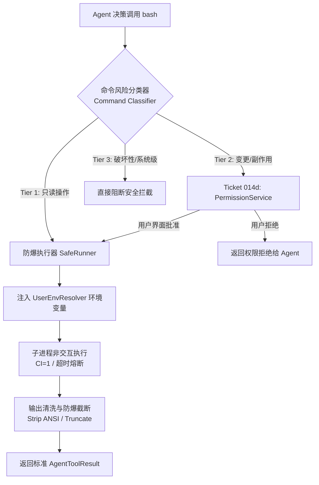

# Rover 伴侣 Agent 受控 Bash 工具设计方案

**状态**：讨论稿 / 方案设计  
**所属模块**：`@rover/runtime`（Agent 执行回路、受控工具链）  
**相关标准与工单**：[ADR-0019](../adr/0019-agent-runtime-callbacks-and-decoupled-lifecycle.md)、[Ticket 014d](../tickets/m2/014d-human-in-the-loop-permission-and-question.md)、[Rover MVP TRD](./Rover%20MVP%20TRD.md)

---

## 一、 背景与动因

### 1.1 现状与冲突
在 Rover MVP 最初的架构规范（TRD 第 162 条）中，为了规避系统破坏与命令逃逸风险，制定了严格的受控工具边界：*“Rover Agent 不得到任意 shell、通用文件写入或任意网络请求工具；代码修改交由 Code Agent 原 Session”*。

然而，随着 Rover 技能（Skill）体系向真实研发协同场景扩展，大量高频轻量任务对本地已配置的成熟 CLI 工具有强依赖：
- **代码审查与流转**：通过 `gh pr view`、`gh pr list`、`glab mr view` 查看 PR/MR 状态与评审意见；
- **DevOps 与发布检查**：通过 `gh run list` 查询 CI 工作流执行结果；
- **环境与接口健康探测**：通过 `curl -I` 探测本地/开发环境服务状态；
- **本地仓库感知**：通过 `git status`、`git branch`、`git log` 了解当前工作区状态。

若将这些秒级操作全部作为重度任务派发给外部 CLI（如启动一个 Claude Code 或 OpenCode 会话），会带来极高的进程开销、漫长的模型冷启动延迟以及割裂的交互体验。

### 1.2 目标定位：伴侣 Agent vs 编码 Agent
- **编码 Agent（Code Agent，如 Claude Code、OpenCode）**：拥有完整终端与文件读写权限，专注长程代码编写、大型重构与测试修复。
- **伴侣 Agent（Rover Agent）**：作为桌面的**协同调度者与辅助决策者**，其 Bash 执行是**轻量、瞬态、辅助决策与 DevOps 衔接**。

因此，演进方向并非无条件开放任意 Shell，而是构建一个**“环境自适应、只读静默 + 变更受控、上下文防爆”的受控 Bash 工具链**。

---

## 二、 核心技术挑战

1. **macOS GUI 环境变量丢失（LaunchAgent 陷阱）**：  
   Rover 是由 Tauri 桌面应用拉起的 Node.js Sidecar。在 macOS GUI 环境下启动的进程仅具备最基础的系统路径（如 `/usr/bin:/bin:/usr/sbin:/sbin`），用户在 `~/.zshrc` 或 `~/.bash_profile` 中配置的 Homebrew 路径（`/opt/homebrew/bin`）、版本管理路径（nvm、asdf）以及认证 Token（`GITHUB_TOKEN`、SSH Key 等）完全丢失，导致命令直接报 `command not found`。
2. **安全边界与权限控制**：  
   必须防范误操作与注入攻击（如模型意外执行 `rm -rf` 或写覆盖关键文件），同时支持具有外部影响的写操作（如合入 PR、提交 Issue）在用户可控的前提下安全执行。
3. **LLM 上下文防爆（Context Explosion）**：  
   CLI 命令（如 `gh api` 或 `curl`）若返回几百 KB 的冗长 JSON/HTML，会直接耗尽模型上下文预算；此外，终端彩色 ANSI 控制符会严重干扰模型的语义理解。
4. **交互式挂起防范（Hanging Prevention）**：  
   若 CLI 触发了交互式询问（如确认提示 `[y/N]` 或 Git 密码输入），在无标准输入的后台进程中会导致永久假死。

---

## 三、 架构设计与技术方案

整体架构分为 **环境解析层**、**命令审计分类层**、**执行与防爆治理层** 以及 **HITL 审批状态机**：



### 3.1 工具契约（Tool Schema）

定义于 `packages/runtime/src/modules/agent/runtime/tools/bash.ts`：

```ts
import { Type, type Static } from '@earendil-works/pi-ai';
import type { AgentTool } from '@earendil-works/pi-agent-core';

export const ExecBashParams = Type.Object({
  command: Type.String({
    description:
      'The bash/zsh command line to execute (e.g. "gh pr view 123", "curl -s ...", "git status"). Non-interactive commands only.',
  }),
  cwd: Type.Optional(
    Type.String({
      description: 'Absolute path to target working directory. Defaults to active workspace.',
    })
  ),
  timeoutMs: Type.Optional(
    Type.Integer({
      description: 'Execution timeout in milliseconds. Default 30000 (30s), max 120000 (2min).',
    })
  ),
});

export type ExecBashParamsType = Static<typeof ExecBashParams>;
```

### 3.2 用户登录 Shell 环境预热解析器 (`UserEnvResolver`)

在 Runtime 启动时预先探查并解析一次用户的完整 Shell 环境变量，并安全缓存：

- **探测原理**：执行 `$SHELL -ilc 'env'`（交互式登录 Shell 模式），提取加载了用户配置后的完整变量表；
- **保留与安全清洗**：
  - 核心保留：`PATH`、`HOME`、`USER`、`SHELL`、`SSH_AUTH_SOCK`、`GITHUB_TOKEN`、`GLAB_TOKEN` 等常用凭据与路径；
  - 覆盖安全标志：强制重置 `CI=1`、`TERM=dumb`、`DEBIAN_FRONTEND=noninteractive`。

### 3.3 命令分级与权限规则架构（分层配置体系）

借鉴 Claude Code 与工业界成熟实践，Rover 的命令安全检查**并非单纯在代码中写死**，而是采用**“内置开箱基线 + 运行期会话记忆 + 用户/项目持久化配置 + 全局安全模式”**的四层分层治理架构：

```mermaid
flowchart TD
  Cmd[待执行 Bash 命令] --> ModeCheck{是否开启无权限跳过模式?}
  ModeCheck -->|是| Exec[执行命令]
  ModeCheck -->|否| BlacklistCheck{命中 Tier 3 黑名单?}
  
  BlacklistCheck -->|是 (如 rm -rf /)| Deny[硬拦截并向模型报错]
  BlacklistCheck -->|否| SessionMem{命中本次会话记忆白名单?\nrememberApproval}
  
  SessionMem -->|是| Exec
  SessionMem -->|否| ConfigAllow{命中用户/项目配置白名单?\n~/.rover/permissions.json}
  
  ConfigAllow -->|是| Exec
  ConfigAllow -->|否| BuiltinTier1{命中内置 Tier 1 只读基线?}
  
  BuiltinTier1 -->|是| Exec
  BuiltinTier1 -->|否 (Tier 2 变更/未知)| HITL[挂起并触发 Ticket 014d\nPermissionService 审批]
  
  HITL -->|单次允许| Exec
  HITL -->|本次会话记住| Remember[写入内存 rememberApproval] --> Exec
  HITL -->|拒绝| Reject[向模型返回拒绝理由]
```

#### 1. 风险分级矩阵

| 分级 | 判定依据与典型命令 | 执行动作 |
| :--- | :--- | :--- |
| **Tier 1: 只读白名单** | 纯查询、无写副作用：<br>• `gh pr view`, `gh pr list`, `gh issue view`, `gh run list`<br>• `glab mr view`, `glab mr list`, `glab issue view`<br>• `git status`, `git log`, `git diff`, `git branch`<br>• `curl -I`, `curl -s`（无 `-X POST/PUT/DELETE`，无 `-d`）<br>• `ls`, `cat`, `head`, `which`, `pwd` | **静默自动放行**，直接执行。 |
| **Tier 2: 变更/副作用** | 具有外部状态写操作或代码修改：<br>• `gh pr merge`, `gh pr close`, `gh issue create`<br>• `glab mr merge`<br>• `git push`, `git checkout -b`, `git commit`<br>• `curl -X POST`, `curl -d ...` | **挂起当前协程**，触发 `onPermissionRequested`，桌面气泡/通知弹出审批卡片供用户单次或会话授权。 |
| **Tier 3: 绝对黑名单** | 破坏性或系统级命令：<br>• `rm -rf /` 或针对系统根目录的操作<br>• `sudo` 提权命令（桌面伴侣严禁提权）<br>• 破坏性磁盘/分区操作 | **硬阻断拦截**，不请求用户，直接向模型报错返回安全阻断说明。 |

#### 2. 四层规则决策流（Rule Hierarchy）

1. **第一层：内置开箱基线（Built-in Baseline）**：
   - 代码内置默认的 Tier 1 只读安全前缀表，保障用户在未配置任何规则时，最常用的查询类 Skill 即可无缝开箱运行。
2. **第二层：运行期会话记忆（Session Memory - Ticket 014d 联动）**：
   - 当遇到 Tier 2 变更命令被拦截时，前端气泡/通知卡片提供两组决算按钮：
     - `[仅允许本次]`：单次放行；
     - `[本次会话记住 (Remember Approval)]`：将该命令或其前缀（如 `gh pr *`）追加至内存 `Set<string>` 中，在当前 Rover 运行时或该轮任务中后续自动放行，避免高频打扰。
3. **第三层：用户与项目持久化配置（User & Project Config）**：
   - 支持从配置文件加载用户自定义规则（例如用户团队自研的 CLI 或定制测试脚本）：
     - **用户全局配置**：`~/.rover/permissions.json`；
     - **项目级配置**：工作区 `.rover/permissions.json`；
     - 配置契约示例：
       ```json
       {
         "autoApprove": [
           "pytest *",
           "go test *",
           "my-internal-cli status *",
           "curl https://api.mycompany.internal/*"
         ],
         "deny": [
           "git push --force *"
         ]
       }
       ```
4. **第四层：全局模式覆写（Execution Modes）**：
   - **默认交互模式（Interactive / Safe）**：严格遵循前述规则与 HITL 确认；
   - **全自动/无人值守模式（Bypass Mode）**：支持测试场景或后台全自动模式（对应类似 `--dangerously-skip-permissions` 的配置），此时除 Tier 3 黑名单外全量放行。

### 3.4 输出防爆与治理（Output Guard）

1. **防爆截断（Head/Tail Truncation）**：
   - 限制单次输出上限为 **30 KB 或 500 行**；
   - 超限时保留头部前 250 行与尾部 100 行，中间插入截断提示：
     ```text
     [... Rover Output Guard: 截断 3420 行 (480 KB)。完整日志已保存至 ~/.rover/tmp/bash_xyz.log ...]
     ```
2. **ANSI 彩色转义码清洗**：
   - 剥离 CLI 输出中包含的颜色转义序列（`\x1b[...m`）与终端光标重置码，防止大模型误读导致幻觉。
3. **超时熔断与进程树清理**：
   - 默认超时 30 秒；
   - 超时后先向子进程组发送 `SIGTERM`，宽限 3 秒后升级为 `SIGKILL`，杜绝孤儿/僵尸进程。

---

## 四、 影响组件与目录规划

按照 Tracer-Bullet Ticket 规范，在 `@rover/runtime` 中规划如下模块结构：

```text
packages/runtime/src/
├── infrastructure/
│   └── env/
│       ├── + [New] resolver.ts                  # macOS 登录 Shell 环境变量探测与缓存
│       └── __tests__/
│           └── + [New] resolver.test.ts
├── modules/
│   └── agent/
│       └── runtime/
│           └── tools/
│               ├── + [New] bash.ts              # ExecBash 工具实现、分类器与防爆执行器
│               └── * [Modified] factory.ts      # 默认装配 bash 工具
└── __tests__/
    └── + [New] bash_tool.test.ts                # 单元测试（分类判定、截断防爆、超时中断）
```

---

## 五、 实施路线与待决议项（Open Questions）

### 5.1 推荐推进路径
1. **阶段一（基础设施与只读闭环）**：
   - 实现 `UserEnvResolver` 解决 macOS 环境变量继承；
   - 实现 `bash` 工具的只读白名单（Tier 1）与防爆截断、超时熔断。
2. **阶段二（HITL 审批打通）**：
   - 待 [Ticket 014d (HITL 状态机)](../tickets/m2/014d-human-in-the-loop-permission-and-question.md) 就绪后，将 Tier 2 变更命令接入 `PermissionService`，支持前端桌面气泡审批卡片。

### 5.2 待决议项（Open Questions）
1. **网络白名单粒度**：
   - 对于 `curl` 请求，除校验 HTTP Method 外，是否需要限制目标域名范围（如仅允许请求 GitHub/GitLab API 及 localhost 服务）？
2. **临时文件生命周期**：
   - 超限截断时写入 `~/.rover/tmp/` 的完整日志，是否需要设置 LRU 或启动时自动清理策略？
