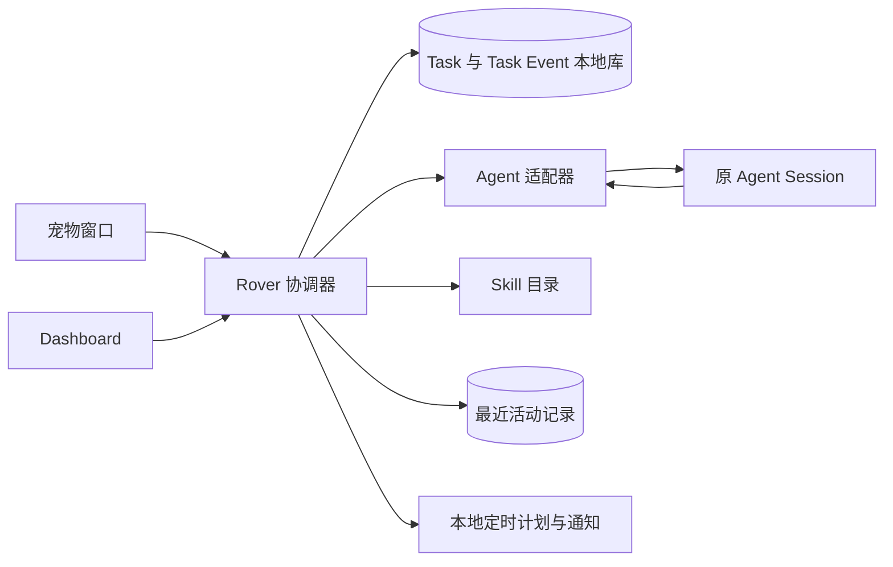

# Rover 技术架构选项

> 状态：React + Tauri + Node Runtime 为当前架构方向；Rover Agent loop 框架待验证 · 2026-09-26 
> 依据：[产品能力边界与核心交互](./Rover%20产品能力边界与核心交互.md)和[领域术语](../../CONTEXT.md)。本文比较实现路径，不改变产品行为。

## 1. 当前进程架构

当前方向是 **React 渲染宠物区域与 Dashboard、Tauri 承载桌面窗口及操作系统能力、独立 Node Runtime 执行 Rover Agent loop**。[Tauri 官方 Node sidecar 指南](https://v2.tauri.app/learn/sidecar-nodejs/)说明了打包方式，也提示长驻进程需设计独立的进程间通信。Rover 的模型与 Agent 逻辑不放进 WebView。

| 进程 | 职责 | 不持有 |
| --- | --- | --- |
| React WebView | 当前输入、气泡、任务卡片、Dashboard 的渲染与用户操作 | API 密钥、Agent 子进程、持久化写入权限 |
| Tauri 宿主 | 透明窗口、托盘、通知、系统打开入口、Node sidecar 的启动/监控和受限 IPC | Rover Agent 的模型循环与业务判断 |
| Node Runtime | Rover Agent loop、Skill 装载、工具与权限策略、Code Agent 适配器、Task 投影和本地数据写入 | 桌面窗口的直接控制 |

Tauri 与 Node 之间定义带版本号的命令和事件协议；由 Tauri 持有 sidecar 生命周期，Node 作为 Task 数据的唯一写入者。React 只通过受限 Tauri 命令交互。首版可用受管的本地管道或本地 socket；如果改用 localhost HTTP，需要额外解决端口暴露与鉴权。Node 运行时应随应用打包，不能要求终端用户另行安装；长驻、崩溃重启、退出清理和升级兼容需做集成验证。

Rover Agent loop 的框架比较与推荐见 [Rover Agent Loop 框架评估](./Rover%20Agent%20Loop%20框架评估.md)。该框架只实现 Rover 自身的直接回答、Skill 使用与派发判断；Claude Code、Codex 等 Code Agent 的原 Session 仍由各自适配器接入。

## 2. Code Agent Session 归谁所有

Rover 的关键承诺是：Task 指向**同一个**专业 Agent Session；Task 建立后，用户在该 Session 中回答问题、批准操作、补充或修改目标，并可在结束后继续处理。Rover 输入不会向已有 Session 注入指令；普通补充请求只根据持久 Task 记录引导用户进入原会话。用户明确指定 `@Agent` 时，Rover 按新需求创建 Session 与 Task；若 `task-recall` 命中相关历史摘要，可把它作为可选背景交给新 Session，未命中不阻止派发。旧 Session 不变。因此，能创建任务但不能稳定地进入原会话，不能算接入成功。

| 方案 | 工作方式 | 优点 | 主要风险 | 判断 |
| --- | --- | --- | --- | --- |
| A. Agent 原生界面持有 Session | Rover 派发或唤起原生 Agent；Agent 通过受支持的事件、Hook 或状态回报通道通知 Rover；任务卡片打开该 Session | 与现有交互边界一致，批准和续办留在 Agent 界面 | 各 Agent 的定向创建、打开会话和状态回报能力不同；可能无法可靠取得 Session ID | **首选，但须实测** |
| B. Rover 持有 Agent 协议连接 | Rover 作为 Codex App Server、Claude Agent SDK 等的客户端，直接创建和监听 Session | 结构化事件、重连和状态投影较容易 | 批准和提问可能发给 Rover 这个协议客户端；若原生界面无法接管，Rover 就必须承载这些交互，与产品基线冲突 | 仅在同一 Session 可交给原生界面时采用 |
| C. Rover 通过无头命令启动，靠终端输出推断状态 | 启动 CLI，解析文本或终端画面 | 可快速做演示 | 输出格式、重连、批准和结果判定脆弱；不具备可审计的 Session 关联 | 不作为正式架构 |

**当前证据。** [Codex App Server](https://developers.openai.com/codex/app-server/)提供 `thread/start`、`thread/resume`、`turn/start` 及事件和批准请求；[Claude Agent SDK](https://code.claude.com/docs/en/agent-sdk/sessions)可记录 Session ID 并按 ID 恢复；[OpenCode Server](https://opencode.ai/docs/server/)提供 Session API 和事件流。这些只证明程序化会话管理可行，**尚未证明** Rover 发起的会话能在各自桌面应用中被定向打开、由用户接手批准，同时继续向 Rover 回报状态。这个跨客户端接管能力是首个验证门槛。

本机安装的 CLI 另提供 `codex resume <SESSION_ID>` 和 `claude --resume <SESSION_ID>`，因此终端中的原会话是可验证的接管路径；仍需实测执行中交接、批准请求和 Rover 状态回报。桌面 App 的定向打开不能从 CLI 恢复能力推断。

### Session 状态观察：Clawd 与 Herdr

这里的 **Code Agent Session** 指 Claude Code、Codex 等 Agent 自己的会话 ID；[Herdr 的 session](https://herdr.dev/docs/session-state/) 指它管理的终端工作区及窗格，两者不能混用。Rover 的 Task 只关联前者，Herdr pane ID 可以作为打开入口的附加定位信息。

| 候选 | 实际观察范围和信号 | 对 Rover 的适用方式 |
| --- | --- | --- |
| [Clawd on Desk](https://github.com/rullerzhou-afk/clawd-on-desk/blob/main/docs/project/agent-runtime-architecture.md) | Claude Code 等 Agent 的 Hook 上报原生 `session_id` 与生命周期事件；部分 Agent 另以本地日志补足。可观察不由它启动的会话。 | 借鉴其按 Agent 接入 Hook、重启后核对日志和进程的做法；由 Rover 自己保存 Task 与原生 Session ID，并归并可信状态。不把 Clawd 桌面应用作为 Rover 的运行时依赖。 |
| [Herdr](https://herdr.dev/docs/agents/) | 管理其终端 pane 中运行的 Agent；有 [Socket API](https://herdr.dev/docs/socket-api/) 暴露 pane、状态和已取得的原生 Session 引用。Claude Code 与 Codex 的会话身份可由集成 Hook 报告，但 `idle/working/blocked` 仍主要来自终端画面规则。 | 当 Rover 决定让 CLI 在 Herdr 中启动和接管时，可用其 API 创建、定位、打开和恢复终端；状态只作为观察信号，仍需 Agent Hook/结果回报验证。不覆盖 Herdr 之外的会话。 |

**当前建议：** Rover 的状态适配器采用 Clawd 式的 Agent 原生事件观察，监听只读状态，不接管 Agent 的批准或提问；Herdr 作为可选的 CLI 承载与跳转组件验证。Rover 自己持有 `Task ID → Agent 类型 + 原生 Session ID → 可用打开入口` 的关联及事件证据。若首版把所有派发的 CLI 都放进 Herdr，可先用其结构化 API 缩短创建、聚焦和恢复链路，但不能把 Herdr 的画面识别结果直接等同于 Task 成功或等待用户的确定事实。

Herdr 启动的 `claude` 仍由 Claude Code 持有原生会话记录。默认情况下，它与用户直接运行 `claude` 所产生的会话都写在 Claude Code 的配置目录；设置 `CLAUDE_CONFIG_DIR`、使用另一台机器或不同账号配置时，会落到不同目录。[Claude Code 的数据目录说明](https://code.claude.com/docs/en/claude-directory)列出 `projects/<project>/<session>.jsonl`；[Herdr 的恢复机制](https://herdr.dev/docs/session-state/)使用 `claude --resume <id>`。因此是**同一种 Claude 会话数据来源，不是同一个 Session，也不是与 Herdr 的 pane/session 状态共用一份数据库**。

## 3. Node Runtime 内部边界

- **窗口层**只读取 Task 投影并发送用户意图；不直接启动 Agent，不持有 API 凭据。
- **Rover 协调器**负责每轮输入的分流、Skill 使用、派发幂等、Session 成功后的 Task 注册、状态归并和通知。即时回复或 Rover 直接完成的 Skill 不创建 Task。
- **Agent 适配器**各自实现能力探测、创建/定位/打开 Session、订阅状态、重连与版本兼容。适配器只上报可证实的事实和 Agent 明确给出的语义摘要；不能把终端文本中的“完成了”自动等同于 Task 成功。
- **本地库**保存 Task、Session 定位、Task Event、最近活动记录和定时计划。可引用 Task 摘要由 Code Agent 按需写入本地文件，JSON 或 JSONL 均可作为首版格式候选；Task 注册表与该摘要文件的具体存储实现分别验证。Skill Package 仍以目录为事实来源，若建立数据库索引则只保存 Skill 的定位信息。
- **`task-recall`**按自然语言线索或 Task ID 检索本地摘要文件；把相关命中作为当前 Rover Agent 回合的工具结果写入 history。它只回答回忆问题时不启动 Session；与新派发组合时，把已保存摘要作为可选背景交给新 Session。摘要缺失或候选有歧义时返回检索结果供 Rover 判断，不能从 CLI 日志或卡片文案编造内容，也不因检索未命中阻断新需求派发。
- **定时计划**由 Rover 的本地调度能力持有。每次触发按 Skill 流程处理；只有实际启动新的 Code Agent Session，才注册对应 Task。

### 最小持久化关系

| 对象 | 必要信息 |
| --- | --- |
| Task | ID、对应 Session ID、原始目标、工作目录、指定/选用 Agent、选用 Skill、当前状态、执行摘要或结果摘要、创建/更新时间 |
| Session 关联 | Task ID、Agent 类型、该 Agent 的 Session ID、配置目录或 Profile、所在机器、打开方式（可含 Herdr pane ID）、可用性、最后观测时间 |
| Task Event | 事件 ID、Task ID、来源、发生时间、事件类型、原始证据引用、用于卡片的简述 |
| 可引用 Task 摘要 | Task ID、由 Code Agent 写出的正文、写入或更新时刻；允许缺失 |
| 派发尝试 | 尝试 ID、输入回合 ID、目标 Agent、工作区、执行阶段、已取得的 Session ID、错误或待核对原因；成功后关联 Task |

**只有 Code Agent Session 成功建立，才注册一对一的 Task。** 派发前可保存内部派发尝试，但它不显示为 Task；失败时 Rover 在当前气泡说明。若进程恰好在 Session 建立后、Task 注册前崩溃，恢复时先按尝试 ID 和 Agent 能力查找既有 Session；无法判断时把尝试留在待核对状态，不盲目新建 Session。派发 Prompt 提供按 Task ID 保存可引用摘要的能力，由 Code Agent 决定是否写入；Rover 不从状态事件补写。用户在 Rover 提出已有 Task 的普通补充要求时，Rover 只定位并打开原 Session，不传入该输入或新建接续 Task；显式 `@Agent` 是独立派发，`task-recall` 命中旧摘要时可将其送入新 Session，未命中则不附加这份背景并继续派发。用户在原 Session 中继续处理仍更新原 Task。收到事件后先落库再更新卡片；重连时按 Agent 能力补齐遗漏事件。会话不可用与执行失败分别记录。

### 状态归并的底线

1. Agent 仍在处理时，单次工具或 API 错误只生成 Task Event，不结束 Task。
2. “需要用户介入”必须有来自 Agent 的明确等待信号，卡片只提供进入原 Session 的入口。
3. Agent 的最终文字和进程退出码都不足以单独证明目标完成；需要 Agent 语义结果与 Session 运行事实相容。冲突时标记待核对并保留证据。
4. 失败后从原 Session 继续，仍更新同一 Task，历史失败事件不删除。

## 4. 先做的验证

为 Codex 和 Claude Code 各做一次最小集成验证，并验证 Tauri/Node 边界：

1. **创建与定位**：指定工作区和目标，得到稳定 Session ID；Rover 重启后仍能定位。
2. **原会话接管**：用户从一个明确的入口进入该 Session，回答澄清或批准；Agent 在同一 Session 继续。记录是否必须使用 CLI/终端，以及桌面 App 是否支持定向打开。
3. **状态回报**：验证排队/执行、等待用户、恢复、结束和失败；断开观察连接后重连，能恢复可信状态。
   同时比较由 Herdr 启动与直接在终端启动的 Claude Code 会话，验证相同配置目录下的原生 Session ID、Hook 和恢复路径；不同 `CLAUDE_CONFIG_DIR` 不应串会话。
4. **冲突场景**：Rover 在“已创建 Session、尚未注册 Task”时退出；Agent 工具报错后继续；Session 文件或入口不可用。检查是否重复派发或误报成功。
5. **进程与窗口**：验证透明宠物、拖动、置顶、输入焦点、多显示器、收起后 Node 继续运行、Node 崩溃重启与 IPC 重连，并实测常驻资源。

若第 2 项无法对某个 Agent 成立，应先决定产品是否接受“原会话”以终端中的该 Agent Session 呈现；在此之前不应把协议客户端方案当作已满足产品基线。

## 已确认的产品约束与待验证事项

- 首版面向 macOS，同时需要接入 Claude Code CLI 与 Codex CLI。
- 点击 Task 后准确打开同一个原生 CLI/TUI Session 即满足原会话入口承诺；创建、观察、重连与准确定位两种 CLI 的能力仍须分别验证。
- 常驻资源预算、安装包大小，以及 Herdr/Clawd 方案的具体适配方式仍待技术验证。
