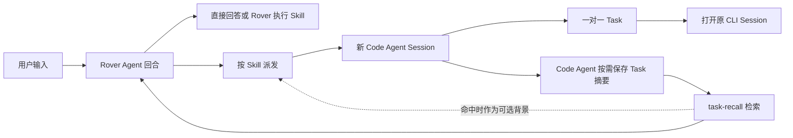

# Rover 产品设计文档

> 版本：MVP 产品设计基线 · 2026-09-26 
> 目标用户：独立开发者 · 首发平台：macOS 
> 上游约束：[产品能力边界与核心交互](../architecture/Rover%20产品能力边界与核心交互.md) · [领域术语](../../CONTEXT.md) 
> 交互参考：[桌面原型](../prototype/index.html) · [评审路径](../prototype/README.md)

## 1. 产品概述

Rover 是常驻 macOS 桌面的全局宠物 Agent。用户通过一个轻量入口提问、交办目标或查看进展。Rover 能直接完成的输入在气泡中回答；需要专业 Code Agent 执行的目标由 Skill 流程派发到本地 Claude Code CLI 或 Codex CLI。每个成功建立的 Code Agent Session 对应 Rover 中的一个 Task，用户从 Task 返回**同一个** CLI Session 继续工作。

Rover 负责接收目标、选择 Skill、按需派发、观察 Session、提醒用户以及保存本地记录。代码理解、执行细节、批准和派发后的目标讨论发生在 Code Agent Session。Rover 的输入不会向已有 Session 追加指令。

### 1.1 用户问题

独立开发者可能同时运行多个 Code Agent Session。任务交给 CLI 后，用户需要记住哪个 Session 在做什么、哪里等待确认、如何回到原会话，以及之前是否做过类似工作。现有 CLI 交互提供执行能力，但缺少一个常驻、跨任务的轻量观察与派发入口。Rover 用宠物区域呈现当前交互和 Task，用 Dashboard 管理较少发生的配置与记录操作。

### 1.2 核心体验承诺

1. **轻量请求即时结束**：问候、可直接回答的问题或由 Rover 自身完成的 Skill 不产生空 Task。
2. **派发后可追踪**：Session 创建成功才出现 Task；Task 与该 Session 一对一，点击 Task 能打开原 CLI Session。
3. **不丢失执行边界**：派发后的澄清、修改、确认和续办都在 Code Agent Session；Rover 只引导进入原会话。
4. **按需回忆过往工作**：`task-recall` 可根据自然语言检索 Code Agent 已保存的 Task 摘要；命中可用于回答或作为新任务的可选背景。检索未命中不阻断新需求派发。
5. **本地可核查**：Rover history、Task、最近活动、定时计划和运行日志在本地保留；用户可从 Dashboard 查看与清理。

## 2. 用户、场景与范围

**主要用户**是同时使用 Claude Code CLI、Codex CLI 处理开发工作的独立开发者。他们通常有多个仓库和终端，但 Rover 不建立全局「项目」对象。需要目标仓库的 Skill 应在该次请求中取得仓库信息；信息不足时由 Rover 先澄清。

| 场景 | 用户期望 | Rover 的结果 |
| --- | --- | --- |
| 「你好」「现在几点」 | 立即得到答案 | Rover 直接回答或自行执行 Skill；无 Task |
| 「整理这份需求文档」 | 交给合适的 Agent 持续处理 | Skill 流程决定是否派发；Session 成功后出现 Task |
| 「`@Codex` 调研这个问题」 | 指定执行者 | 尝试派发 Codex；不可用时说明，不能暗换 Agent |
| 「给刚才那个任务再加测试」 | 继续已交办目标 | 定位并打开原 Session；Rover 不向其传入这条文本 |
| 「`@Codex` 给支付功能加测试，我记得以前做过」 | 建立新的 Codex 工作会话 | 新建 Session 与 Task；若 `task-recall` 命中相关摘要，作为可选背景传入 |
| 「之前做过支付链路巡检吗」 | 回忆过往工作 | 检索已保存 Task 摘要，在气泡回答并提供来源入口；不创建 Task |
| 「每天九点半检查支付链路」 | 建立并运行计划 | `scheduled-task` 派发 Code Agent 创建计划；Rover 保存并按计划触发 |

### 2.1 MVP 包含

- macOS 宠物区域、文本输入、当前气泡、任务列表和独立 Dashboard。
- 一份全局且跨重启保留的 Rover Agent history；接近上下文窗口限制时才 compaction。
- 界面维护的待处理 Prompt 队列及逐条继续确认；队列不跨退出保存。
- 内置 `agent-dispatch`、`task-recall`、`pet-task-state`，以及可按用户目标调用的业务 Skill。
- Claude Code CLI 与 Codex CLI 的 Session 创建、状态观察、准确打开原会话及重启后的关联恢复。
- Task 状态、执行摘要、结果文案、需关注提醒、会话入口、最近活动。
- 定时计划的创建 Skill、Rover 触发、暂停、恢复、删除、运行日志和错过触发记录。
- Rover Agent 的模型配置，以及 Rover 本地数据查看和删除入口。

### 2.2 MVP 不包含

语音输入、Rover 自身的会话列表、项目工作区管理、Skill 草稿、自动沉淀可复用经验，以及向已有 Code Agent Session 注入 Rover 后续输入。只需打开准确的原 CLI/TUI Session；不要求在 Claude 或 Codex 桌面 App 中定向打开。长期记忆和对所有旧对话的精确搜索另行设计。

## 3. 信息架构与职责

| 区域或对象 | 面向用户的职责 | 数据来源 |
| --- | --- | --- |
| 宠物区域 | 随时输入、查看当前气泡、浏览 Task、接收重要提醒 | Rover 当前回合、Task 投影 |
| Dashboard | 管理 Skill、定时计划及日志、最近活动、模型配置、本地数据 | Rover 本地记录 |
| Rover Agent history | 为跨输入理解提供上下文；承载本轮 `task-recall` 工具结果 | 已提交的 user/assistant/tool 消息 |
| Task | 展示一个 Code Agent Session 的目标、状态、结果和入口 | Session 关联、可信状态事件、Agent 回报 |
| Code Agent Session | 承载具体工作和用户决定 | Claude Code CLI 或 Codex CLI |
| 可引用 Task 摘要 | 按需回忆或补充新任务背景 | 原 Session 的 Code Agent 自主决定写出的本地摘要 |
| 最近活动 | 展示近期完成的 Task 结果及 Rover 实际完成的操作 | Rover 内置 Agent Tool |

Task 卡片的**执行摘要/结果文案**与**可引用 Task 摘要**是不同对象。前者用于当前状态展示；后者由 Code Agent 在其 Session 中判断是否值得保存，可能不存在。`task-recall` 不能把卡片文案、CLI 日志或 Rover 对话当作后者的替代。

### 3.1 核心关系

## 4. 核心交互流程

### 4.1 输入、澄清与队列

1. 用户提交 Prompt；界面显示短暂「判断中」。真正提交的输入追加到同一份 Rover Agent history。
2. Rover 判断能否直接回答、由 Rover 自身执行 Skill、先澄清，或按 Skill 派发。业务 Skill 决定是否需要创建 Code Agent Session；未命中业务 Skill 时仍可使用内置 `agent-dispatch`。
3. 需要目标仓库等 Skill 前置条件而输入没有提供时，Rover 在气泡提问。澄清完成前不创建 Session 或 Task。
4. 一次 Rover 回合未结束时，用户仍可提交其他 Prompt。界面按顺序暂存；这些文字尚未进入 Agent history，也不形成 Task。回合结束后，界面逐条询问是否继续。用户确认才送入下一轮；暂不继续时可保留或移除。
5. 若上一回合以澄清结束，队列中的下一条默认视为新输入；用户可以明确切换为对澄清问题的回答。Rover 完全退出时提示未处理队列会丢失。

### 4.2 Skill 选择与派发

| 输入形式 | 分流规则 | Task 规则 |
| --- | --- | --- |
| 普通输入 | Rover 回答或匹配业务 Skill；Skill 可自行完成，也可调用派发 Skill | 仅 Session 成功建立时创建 |
| `/skill` | 使用明确指定的 Skill；不存在时如实说明 | 由该 Skill 流程决定 |
| `@Agent` | 使用内置派发 Skill 启动指定 Agent；不暗换执行者 | 指定 Session 成功建立后创建 |
| `/skill` 与 `@Agent` | 同时遵守业务流程和指定执行者 | 每个成功建立的 Session 各有一个 Task |

同一 Skill 可以派发多个 Session；每个成功建立的 Session 单独形成 Task。派发失败不创建空 Task；部分成功时 Rover 在气泡说明各自结果。派发 Prompt 向 Code Agent 提供目标、Skill 要求的上下文、`pet-task-state` 和保存可引用 Task 摘要的能力。Code Agent 决定是否以及何时保存摘要。

### 4.3 已派发目标与新需求

Task 建立后，用户对原目标的普通补充、修改或确认应在原 Code Agent Session 完成。用户把这类内容输入 Rover 时，Rover 根据 Task 记录引导打开原会话；不转发文本、不创建接续 Task，也不在宠物区域展示 Code Agent 对话。

用户显式选择 `@Agent` 时，这是**新派发**，建立新 Session 与 Task。若新需求提到过往工作，Rover 可先运行 `task-recall`。检索命中则把相关摘要作为当前 Rover history 的工具结果，并作为可选背景送入新 Session；未命中则按当前需求派发，不假称知道过去做过什么。原 Session 不受影响。

### 4.4 回忆旧任务

`task-recall` 接受 Task ID 或自然语言线索，但不要求用户知道 ID。它从本地已保存的可引用 Task 摘要中检索，并将命中内容按需加入当前 Rover Agent 回合的 history。纯回忆问题由 Rover 在气泡回答，附来源 Task 入口；不建立 Code Agent Session。

可引用摘要的生命周期是：派发时向 Code Agent 提供与当前 Task 关联的保存能力；Code Agent 在原 Session 中判断是否需要写入或更新；Rover 只在用户需求需要历史信息时检索当时已保存的内容。保存格式可选本地 JSON 或 JSONL。Rover 不自动把每个 Task 的卡片文案转存为可引用摘要。

检索到多个无法区分的候选时，纯回忆问题先请用户选择。找到 Task 记录却没有 Code Agent 保存的摘要时，可告知用户存在该 Task，但无法确认其具体工作内容，并提供原 Session 入口。面向新需求的派发不以检索命中为前置条件。

### 4.5 定时计划

1. 用户提出计划目标；MVP 的 `scheduled-task` Skill 派发 Code Agent 创建和验证计划。计划创建过程对应一个 Task。
2. Rover 保存计划并在约定时间自行触发，按保存的 Skill 流程处理。一次触发是否形成新 Task，取决于该流程是否成功建立新 Session。
3. Dashboard 展示计划、每次触发及运行结果，支持暂停、恢复、删除。删除停止未来触发，已有运行日志保留。
4. Rover 完全退出期间错过触发时，重启后记录为「错过」并提示用户，不自动补跑；后续触发按计划继续。触发失败但没有建立 Session 时只留下运行日志与气泡说明，不产生 Task。

## 5. 界面设计要求

### 5.1 宠物区域

宠物区域保留悬浮待命、输入框、当前气泡和 Task 列表。收起宠物不会停止 Code Agent Session 或清除已保存 Task。输入框在已有 Task 运行期间始终可用。

气泡只表达当前 Rover 回合或重要 Task 事件；下一条输入可替换当前气泡，不提供气泡历史列表。判断中、需要补充、已派发等非终态气泡约 10 秒后可自动收起，鼠标悬停暂停计时。需要用户介入、重要完成结果、失败和需关注异常可以主动提醒；普通进度只更新 Task 卡片。

### 5.2 Task 卡片与详情

| 状态 | 卡片内容 | 用户操作 |
| --- | --- | --- |
| 排队或运行 | 目标、可信的纯文本执行摘要、动态边框 | 点击打开原 Session |
| 等待用户 | 目标、执行摘要、「去确认」 | 在原 Session 回答、选择或批准 |
| 已完成 | Markdown 结果文案、重要产物、「查看会话」 | 打开原 Session 查看或继续 |
| 失败或取消 | 明确的未完成原因、保留的事件、「查看会话」 | 在原 Session 查看或恢复 |
| 状态待核对 | 最近一次可信状态及核对提示 | 打开原 Session；Rover 不猜测结果 |
| 原会话不可用 | 原结果及不可用说明 | 查看记录；不跳转到其他会话 |

Task 列表按处理中在前、已结束在后排列，不用额外的状态分组标题。Agent 在失败或完成后从**原 Session** 继续时，同一 Task 回到处理中，先前的结束事件保留。Rover 不提供「重新派发」按钮。单次 API 或工具错误且 Agent 仍继续执行时，仅记录事件，不把 Task 标为失败。

### 5.3 Dashboard

| 入口 | MVP 内容与行为 |
| --- | --- |
| Skill 目录 | 显示内置和业务 Skill 的名称、描述与来源；不提供 Skill 草稿 |
| 定时计划 | 查看计划、暂停、恢复、删除，以及触发和运行日志 |
| 最近活动 | 展示已结束 Task 的结果及 Rover 实际完成的操作；不收录问候和普通问答，本地记录不自动过期 |
| 需关注事项 | 汇总等待用户、失败、会话不可用和需核对的 Task |
| 模型配置 | 配置 Rover Agent 的提供商、模型、必要凭据与自定义端点；验证模型具有所需工具调用能力。Code Agent CLI 各自的配置由其工具管理 |
| 本地数据 | 查看和删除 Rover 保存的记录；删除前提示仍在运行的 Session 与计划，不暗中终止 CLI |

## 6. 本地数据与恢复

| 数据 | 持久化 | 规则 |
| --- | --- | --- |
| Rover Agent history | 是 | 全局一份，重启后继续；接近模型上下文限制时 compaction，不承诺逐字找回旧气泡 |
| Task、Session 定位与 Task Event | 是 | Task 注册表是会话关联的事实来源；重启后核对原 Session |
| 可引用 Task 摘要 | 有写入时保存 | Code Agent 按需写入本地 JSON 或 JSONL 格式候选；具体格式留给技术验证 |
| 最近活动 | 是 | 不自动过期；Dashboard 显示最近项并可继续翻看，用户可主动删除 |
| 定时计划与运行日志 | 是 | 错过、成功和失败触发均有记录；删除计划不清除既有日志 |
| 待处理 Prompt 队列 | 否 | 退出时提示将丢失；未确认前不进入 Agent history |

Rover 重启时使用本地 Task 记录重新关联 CLI Session。无法证实当前状态时显示「状态待核对」，不按进程退出或最终文字单独推断成功。会话不可用与任务执行失败分别记录。删除 Rover 本地数据可能使 Task 与原 Session 的关联无法恢复，因此操作前要说明影响。

## 7. MVP 验收

下列场景应在 Claude Code CLI 与 Codex CLI 均可用的测试环境中验证；交互原型只用于评审行为，不代替真实集成验证。

1. 问候和 Rover 自行完成的 Skill 能在气泡回答，不创建 Task；`@Agent` 目标尝试启动指定 CLI。
2. Session 创建成功才注册 Task；多个 Session 对应多个 Task；失败派发无空 Task，部分失败有逐项说明。
3. Task 点击准确打开同一个原 CLI Session；Rover 重启后仍可定位。用户在该 Session 确认或继续，同一 Task 更新。
4. Rover 中输入对已有目标的普通补充时，仅引导进入原 Session，不注入文本或新建接续 Task。
5. 新派发前 `task-recall` 命中时，相关摘要进入当前 Rover history 和新 Session；未命中时仍派发，且不编造旧工作内容。
6. 纯回忆问题命中时在气泡回答并显示来源；摘要缺失时承认不知道具体工作；候选歧义时请求选择，均不创建 Task。
7. Code Agent 可在原 Session 中自行决定写入可引用摘要；Task 卡片的执行摘要和结果文案不会被当成该摘要。
8. 运行中、等待用户、完成、失败、取消、状态待核对及会话不可用能正确映射；单次可恢复错误不误报失败。
9. 定时计划可暂停、恢复、删除；触发成功关联 Task，触发失败不创建 Task；完全退出期间错过的触发留日志且不补跑。
10. 全局 history、Task 和计划重启后恢复；未确认 Prompt 队列不恢复且退出前有丢失提示；最近活动与本地数据删除入口可用。

## 8. 衡量与技术依赖

内测阶段记录以下质量指标，目标阈值在真实双 CLI 集成验证后确定：Session 创建到 Task 注册的成功率、Task 打开原 Session 的准确率、等待用户状态的误报与漏报、计划触发结果记录完整率、`task-recall` 命中及歧义比例、Rover 输入到即时反馈的耗时。派发失败产生空 Task、打开错误 Session、把检索未命中的旧工作当成事实，应作为发布阻断缺陷。

产品行为已确定，以下属于技术验证事项：Claude Code CLI 与 Codex CLI 的创建、观察、恢复和准确打开；Herdr/Clawd 方案如何借鉴或组合；Rover 使用 Pi Agent Core/Pi AI 的模型与工具配置；Code Agent 写入本地 Task 摘要的接口、JSON/JSONL 格式和检索索引；macOS 常驻资源预算。技术选型不能改变本文件规定的 Task/Session 边界和用户交互。
