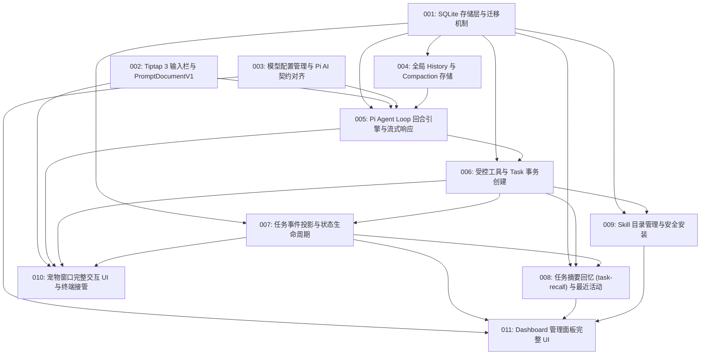

# M2 Rover 核心 (Rover Core) 任务清单

本目录记录按照 Matt Pocock 的 **Tracer-Bullet Tickets** 方法论拆解的 M2（Rover 核心）工程任务。
每个 Ticket 均为一条端到端可验证的垂直切片，受限于单个 Agent 上下文窗口容量，并声明了精确的前置阻塞依赖（`Blocked By`）。

History、消息写入粒度与 Compaction 以 [ADR-0014](../../adr/0014-linear-rover-entries-and-compaction.md) 为准，替代 ADR-0012 中相应的旧设计。回合生命周期与恢复策略仍需在存储实施前定稿。

## 任务依赖拓扑（DAG Frontier）

## Ticket 列表与状态

| ID | 任务标题 | 阻塞项 (Blocked By) | 状态 | 核心产物 / 涉及层 |
|:---|:---|:---|:---|:---|
| [001](./001-sqlite-storage-and-migrations.md) | SQLite 存储层与版本迁移机制 | *None (Frontier)* | DONE | `packages/runtime` (better-sqlite3, migrations) |
| [002](./002-tiptap-prompt-input-and-prompt-document-v1.md) | Tiptap 3 输入栏与 PromptDocumentV1 契约 | *None (Frontier)* | DONE | `packages/app` (Tiptap 3, Suggestion), `packages/runtime` (Zod schema) |
| [003](./003-pi-models-config-and-keychain-bridge.md) | 模型配置管理与 Pi AI 契约对齐 | *None (Frontier)* | DONE | `packages/runtime` (~/.rover/models.json, tRPC), `packages/app` |
| [004](./004-rover-history-and-compaction.md) | 全局 History 与 Compaction 存储 | 001 | DONE | `packages/runtime` (rover_entry, compaction) |
| [005](./005-pi-agent-loop-and-turn-engine.md) | Pi Agent Loop 回合引擎与流式响应 | 001, 002, 003, 004 | TODO | `packages/runtime` (Pi Agent loop, turn protocol, WS stream) |
| [006](./006-controlled-tools-and-task-transaction-creation.md) | 受控工具链与 Task 事务原子创建 | 001, 005 | TODO | `packages/runtime` (dispatch_attempt, session_ref, task, agent-dispatch) |
| [007](./007-task-event-projection-and-status-lifecycle.md) | 任务事件投影与状态生命周期管理 | 001, 006 | TODO | `packages/runtime` (observe/spool consumer, task_event, state projection) |
| [008](./008-task-recall-and-activity-ledger.md) | 任务摘要回忆 (task-recall) 与最近活动台账 | 001, 006, 007 | TODO | `packages/runtime` (n-gram index, task_summary, activity) |
| [009](./009-skill-management-and-safe-installation.md) | 内置 Skill 发现与加载机制 | 001, 006 | TODO | `packages/runtime` (builtin skills, loader, SKILL.md parser) |
| [010](./010-pet-window-ui-and-task-interaction.md) | 宠物窗口交互展开态、任务卡片与终端接管 | 002, 005, 006, 007 | TODO | `packages/app` (PetWindow, cards, queue), `src-tauri` (open_task) |
| [011](./011-dashboard-window-ui.md) | Dashboard 管理面板完整功能视图 | 003, 007, 008, 009 | TODO | `packages/app` (DashboardWindow, skills, models, activity, attention) |
