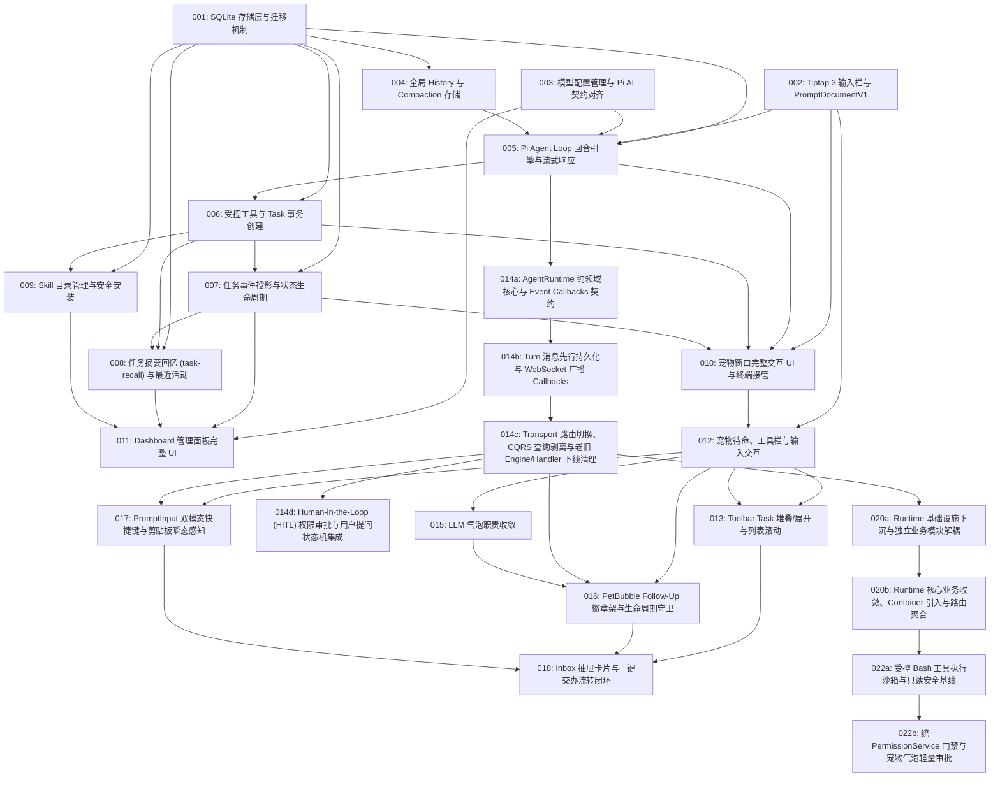

# M2 Rover 核心 (Rover Core) 任务清单

本目录记录按照 Matt Pocock 的 **Tracer-Bullet Tickets** 方法论拆解的 M2（Rover 核心）工程任务。
每个 Ticket 均为一条端到端可验证的垂直切片，受限于单个 Agent 上下文窗口容量，并声明了精确的前置阻塞依赖（`Blocked By`）。

History、消息写入粒度与 Compaction 以 [ADR-0014](../../adr/0014-linear-rover-entries-and-compaction.md) 为准，替代 ADR-0012 中相应的旧设计。回合生命周期与恢复策略仍需在存储实施前定稿。

宠物交互重构拆为 012–015 四条可验收切片，修订已完成的 010 中的交互；010 保留历史完成状态。新票均从 TODO 开始，已有局部代码不等同于完成验收。执行时只补齐差异，沿用现有 Tailwind、编辑器、Task 接管及 compact 尺寸设置；SQLite Inbox 与外部告警仍属于 M3。

## 任务依赖拓扑（DAG Frontier）

## Ticket 列表与状态

| ID                                                             | 任务标题                                  | 阻塞项 (Blocked By) | 状态 | 核心产物 / 涉及层                                                                          |
| :------------------------------------------------------------- | :---------------------------------------- | :------------------ | :--- | :----------------------------------------------------------------------------------------- |
| [001](./001-sqlite-storage-and-migrations.md)                  | SQLite 存储层与版本迁移机制               | _None (Frontier)_   | DONE | `packages/runtime` (better-sqlite3, migrations)                                            |
| [002](./002-tiptap-prompt-input-and-prompt-document-v1.md)     | Tiptap 3 输入栏与 PromptDocumentV1 契约   | _None (Frontier)_   | DONE | `packages/app` (Tiptap 3, Suggestion), `packages/runtime` (Zod schema)                     |
| [003](./003-pi-models-config-and-keychain-bridge.md)           | 模型配置管理与 Pi AI 契约对齐             | _None (Frontier)_   | DONE | `packages/runtime` (~/.rover/models.json, tRPC), `packages/app`                            |
| [004](./004-rover-history-and-compaction.md)                   | 全局 History 与 Compaction 存储           | 001                 | DONE | `packages/runtime` (rover_entry, compaction)                                               |
| [005](./005-pi-agent-loop-and-turn-engine.md)                  | Pi Agent Loop 回合引擎与流式响应          | 001, 002, 003, 004  | DONE | `packages/runtime` (Pi Agent loop, turn protocol, WS stream)                               |
| [006](./006-controlled-tools-and-task-transaction-creation.md) | 受控工具链与 Task 事务原子创建            | 001, 005            | DONE | `packages/runtime` (dispatch_attempt, session_ref, task, agent-dispatch)                   |
| [007](./007-task-event-projection-and-status-lifecycle.md)     | 任务事件投影与状态生命周期管理            | 001, 006            | DONE | `packages/runtime` (observe/spool consumer, task_event, state projection)                  |
| [008](./008-task-recall-and-activity-ledger.md)                | 任务摘要回忆 (task-recall) 与最近活动台账 | 001, 006, 007       | TODO | `packages/runtime` (n-gram index, task_summary, activity)                                  |
| [009](./009-skill-management-and-safe-installation.md)         | 内置 Skill 发现与加载机制                 | 001, 006            | DONE | `packages/app/resources/skills` (内容与附件), `packages/runtime` (loader, SKILL.md parser) |
| [010](./010-pet-window-ui-and-task-interaction.md)             | 宠物窗口交互展开态、任务卡片与终端接管    | 002, 005, 006, 007  | DONE | `packages/app` (PetWindow, cards, queue), `src-tauri` (open_task)                          |
| [011](./011-dashboard-window-ui.md)                            | Dashboard 管理面板完整功能视图            | 003, 007, 008, 009  | TODO | `packages/app` (DashboardWindow, skills, models, activity, attention)                      |
| [012](./012-pet-toolbar-and-prompt-interaction.md) | 宠物待命、工具栏与输入交互重构 | 002, 010 | DONE | `packages/app` (Pet, PetToolbar, PromptInput, PetWindow) |
| [013](./013-pet-task-panel-and-scroll.md) | Task 堆叠、展开与列表滚动 | 012 | TODO | `packages/app` (PetToolbar/Task) |
| [014a](./014a-agent-runtime-core-and-event-callbacks.md) | AgentRuntime 纯领域核心与 Event Callbacks 契约 | 005 | DONE | `packages/runtime` (AgentRuntime, Callbacks, 内存队列) |
| [014b](./014b-turn-persistence-and-websocket-callbacks.md) | Turn 消息先行持久化与 WebSocket 广播 Callbacks | 014a | DONE | `packages/runtime` (TurnPersistenceCallbacks, WS 广播) |
| [014c](./014c-runtime-migration-cqrs-and-engine-cleanup.md) | Transport 路由切换、CQRS 查询剥离与老旧 Engine/Handler 下线清理 | 014b | DONE | `packages/runtime` (tRPC router, 物理删除 engine/handler) |
| [014d](./014d-human-in-the-loop-permission-and-question.md) | Human-in-the-Loop (HITL) 权限审批与用户提问状态机集成 | 014c | TODO | `packages/runtime` (AbstractHITL, PermissionService) |
| [015](./015-pet-bubble-output-isolation.md) | PetBubble 的 LLM 输出职责收敛 | 012 | DONE | `packages/app` (PetBubble, 类型化事件订阅) |
| [016](./016-pet-bubble-follow-up-badge-shelf.md) | PetBubble Follow-Up 徽章架与生命周期守卫 | 012, 015, 014c | DONE | `packages/app` / `packages/runtime` (BadgeShelf, 队列同步、消费事件、自动接力) |
| [017](./017-prompt-input-dual-mode-and-clipboard-sense.md) | PromptInput 双模态快捷键与剪贴板瞬态感知 | 012, 014c | TODO | `packages/app` (usePromptEditor, keydown, Ghost Pill) |
| [018](./018-inbox-drawer-and-handoff-delegation.md) | Inbox 抽屉卡片与一键交办流转闭环 | 013, 016, 017 | DONE | `packages/app` (PetToolbar/Inbox, Drawer, Handoff) |
| [020a](./020a-runtime-infrastructure-and-isolated-modules-refactoring.md) | Runtime 基础设施层下沉与独立业务模块 (Models/Skills) 解耦重构 | 014c | DONE | `packages/runtime` (infrastructure/, modules/models, modules/skills) |
| [020b](./020b-runtime-core-modules-container-and-trpc-router-refactoring.md) | Runtime 核心业务模块收敛、Container 组合根引入与 tRPC 路由聚合重构 | 020a | DONE | `packages/runtime` (container.ts, modules/tasks, modules/agent, trpc/) |
| [022a](./022a-controlled-bash-tool-runner-and-read-only-baseline.md) | 受控 Bash 工具执行沙箱与只读安全基线 | 020b | TODO | `packages/runtime` (UserEnvResolver, CommandClassifier, SafeRunner, bash tool) |
| [022b](./022b-unified-permission-service-hitl-and-bubble-approval.md) | 统一 PermissionService 门禁与宠物气泡轻量审批 | 022a | TODO | `packages/runtime` (AbstractHITL, PermissionService, tRPC, Bubble UI) |

## 宠物重构执行边界

- 每个独立功能对应一个目录，主实现放在该目录的 `index.tsx`：气泡使用 `pet/PetBubble/index.tsx`，工具栏使用 `pet/PetToolbar/index.tsx`，Task、Inbox、PromptInput 分别位于 `pet/PetToolbar/` 下的功能目录；取消 PetPanel；`pet/index.tsx` 是窗口组合入口。组件专用的子组件、事件处理和私有 Hook 留在所属功能内，不为它们另建功能目录。
- 遵循 ADR-0018：彻底废弃旧有纵向 `PendingQueue.tsx` 列表，采用 `PetBubble` 底部单行横向微型徽章架（016），配合输入栏双模态快捷键（017）与 Inbox 一键交办流转（018）。
- 建议顺序：012 → 013 → 014 → 016 → 017 → 018。
- 每票同时交付实际交互与对应验证，避免先做一次全量机械拆文件，再集中补交互。

- 按 TRD §2.1 将私有逻辑留在所属组件内，仅提取真实共享状态或有独立生命周期的接口；不扩大为 Dashboard、Task 服务或全局状态重构。
- 已有未提交实现先保留，按对应票逐项核对；后续实施只迁移必要引用，删除明确不再使用的旧代码。
