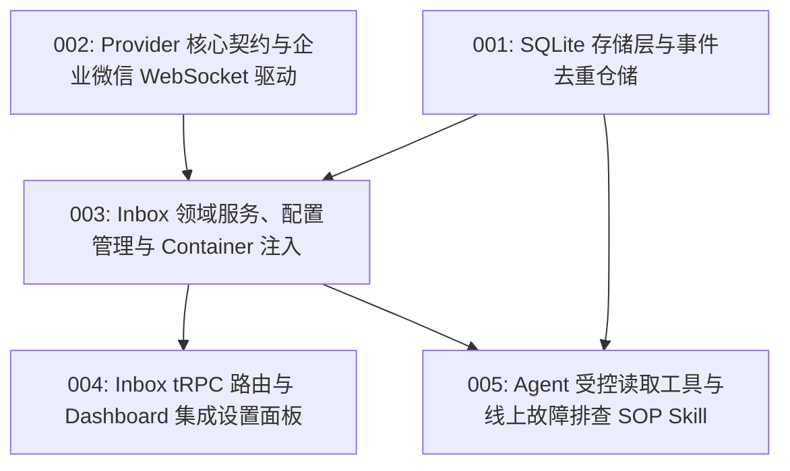

# M3 定时与 Inbox (Inbox Service & Schedulers) 任务清单

本目录记录按照 Matt Pocock 的 **Tracer-Bullet Tickets** 方法论拆解的 M3（定时与 Inbox）工程任务。
每个 Ticket 均为一条端到端可验证的垂直切片，受限于单个 Agent 上下文窗口容量，并声明了精确的前置阻塞依赖（`Blocked By`）。

依据 [ADR-0005](../../adr/0005-remote-inbox-outbox.md)、[ADR-0018](../../adr/0018-multi-source-input-steer-and-follow-up-interaction.md)、[Rover Inbox 投递协议 v1](../../architecture/Rover%20Inbox%20%E6%8A%95%E9%80%92%E5%8D%8F%E8%AE%AE%20v1.md) 以及本次方案评审结论，`InboxService` 遵循 **Provider 驱动架构**、**本地出站 WebSocket 直连（企业微信智能机器人）**、**动态开关与凭证脱敏**，以及**通过 Skill SOP 连通 Coding Agent 与本地 `csp-monitor` 命令行**的轻量化设计。

---

## 任务依赖拓扑（DAG Frontier）

---

## Ticket 列表与状态

| ID | 任务标题 | 阻塞项 (Blocked By) | 状态 | 核心产物 / 涉及层 |
| :--- | :--- | :--- | :--- | :--- |
| [001](./001-inbox-sqlite-storage-and-repository.md) | Inbox SQLite 存储层与事件去重仓储 | _None (Frontier)_ | DONE | `packages/runtime` (002 migration, `InboxRepository`) |
| [002](./002-inbox-provider-interface-and-wecom-driver.md) | Inbox Provider 核心契约与企业微信 WebSocket 驱动 | _None (Frontier)_ | DONE | `packages/runtime` (`@wecom/aibot-node-sdk`, `WecomInboxProvider`) |
| [003](./003-inbox-service-lifecycle-and-container-injection.md) | Inbox 领域服务、配置持久化与 Container 注入 | 001, 002 | DONE | `packages/runtime` (`InboxService`, `~/.rover/inbox.json`, `container.ts`) |
| [004](./004-inbox-trpc-router-and-dashboard-settings.md) | Inbox tRPC 路由与 Dashboard 集成设置面板 | 003 | DONE | `packages/runtime` (tRPC router), `packages/app` (Dashboard 设置卡片) |
| [005](./005-inbox-agent-tool-and-incident-sop-skill.md) | Agent 受控读取工具与线上故障排查 SOP Skill | 001, 003 | TODO | `packages/runtime` (`get_inbox_detail` tool), `packages/app` (排查 Skill SOP) |

---

## 架构原则与执行红线

1. **到达不自动唤醒模型**：
   - 外部消息（如企微 @ 提问、监控告警）到达本地入库仅更新未读数与桌面徽章，**坚决不自动调用 LLM 或主动派发 Agent**，防止 Token 盗刷与非法注入。
2. **Provider 隔离与单向数据流**：
   - 所有外部数据源必须实现 `InboxProvider` 接口；
   - Provider 内部负责多模态正文解析与标题/摘要提取，通过 `onMessage` 分发器提交给 `InboxService`，严禁 Provider 直接操作数据库。
3. **零中间件直连**：
   - 企业微信智能机器人使用 `@wecom/aibot-node-sdk` 建立主动出站长连接（Outbound WebSocket），开发者的本地 Node Runtime 直连企微网关，无需公网 IP、域名备案或中间代理服务器。
4. **SOP 传递取代万能工具箱**：
   - Rover 自身不封装 `csp-monitor` 等内部业务 CLI 工具；
   - 通过在 `incident-investigation` Skill 中编排标准作业程序，在派发时将 SOP 注入给 Coding Agent（如 Claude Code），由拥有完整终端权限的 Coding Agent 在目标仓库自主执行 `csp-monitor` 与代码排查。
